# Отчёт к лабораторной работе №10 Семёнов В.А.
## Авторизация: куки и сессии
### 1. Столбец password_hash

Потому что в bcrypt хэш генерируется из 60-ти символов, однако стандарты могут поменяться, поэтому 255 взяли запасом на будущее

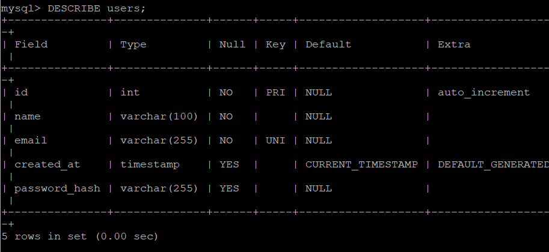
### 2. Partials

Чтобы не копипастить в верстку каждой страницы шапку сайта, мы выделили ее в отдельный файл и подключаем одной строкой. Это даёт возможность легко изменять шапку в nav.php, которая автоматом отобразится на всех наших страницах boardy

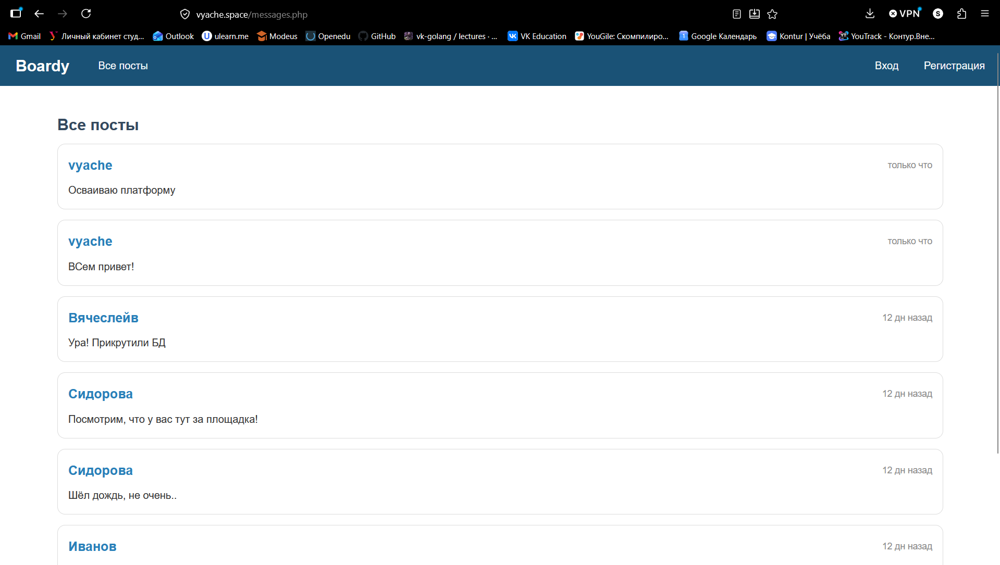
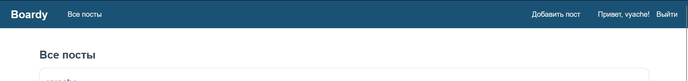
### 3. Вёрстка форм по макетам

Сделал почти 1 в 1))

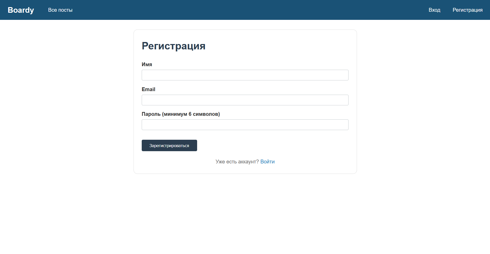
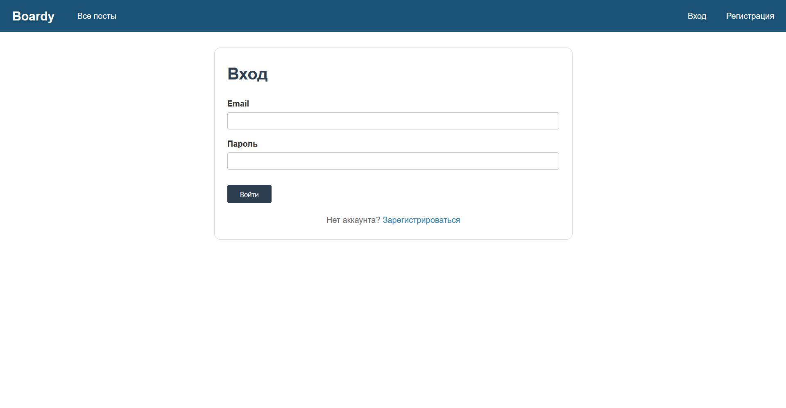
### 4. Регистрация

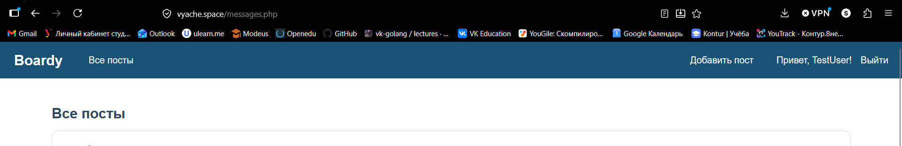
### 5. Хеш в базе

$2y$10$kx8AQWf 
$2y$ данный раздел обозначает версию алгоритма хеширования в Php
10$ cost factor, он определяет кол-во итераций во время хеширования
далее идет соль - рандомная строка, которая добавляется в наш пароль, дабы хэш одного и того же пароля был разный, чтобы обезопасить от rainbow tables
после чего идет уже сам хэш пароля

если увеличить кост фактор с 10 до 15, то кол-во итераций возрастет с 2**10 до 2**15, то есть алгоритм станет в 32 раза более тяжелым

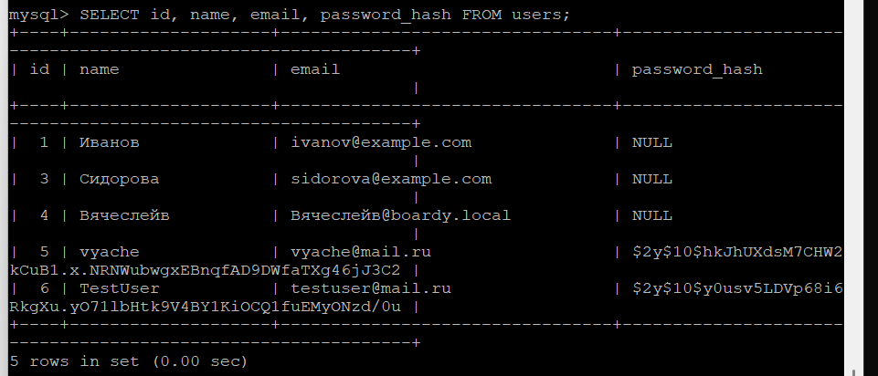
### 6. Защита от повторной регистрации

email нужно проверять перед insert для того, чтобы в нашей таблице не было 2-ух записей с одинаковым email, но у нас в атрибуте email стоит UNIQUE, поэтому БД просто не примет такой запрос и выдаст ошибку. Поэтому таким образом мы явно даем понять пользователю, что такой адрес уже занят и избегаем ошибок на уровне БД

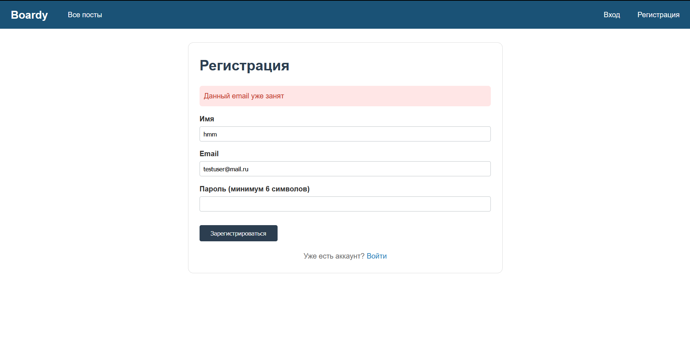
### 7. Логин

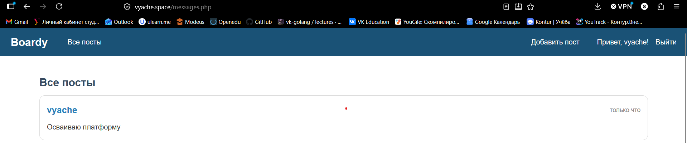
### 8. Неверный пароль

Для того, чтобы нельзя было понять, что мы вводим правильный логин и начать брутфорсить пароль к этой учетной записи

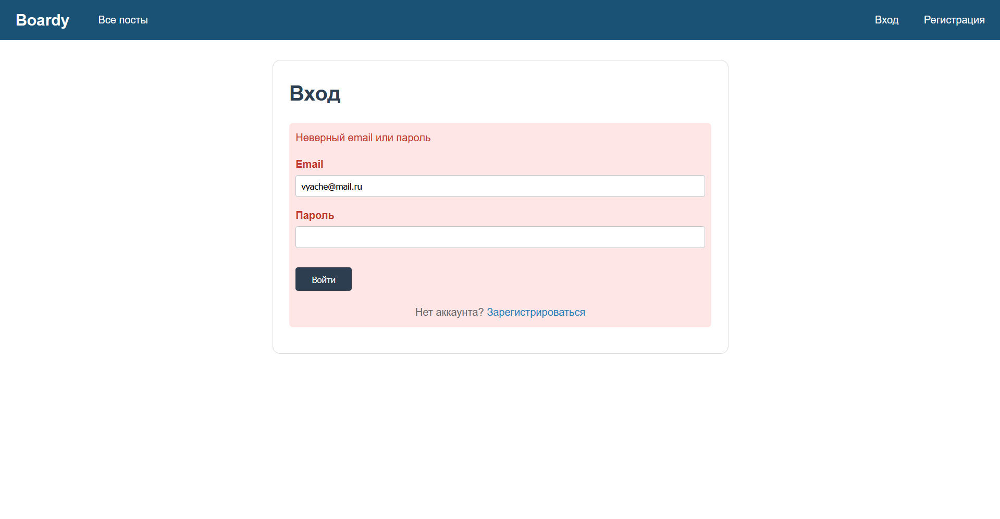
### 9. Кука PHPSESSID

В значении куки хранится радомный айди, который генерирует php и связывает с данными сессии. Таким образом мы отдаем клиенту лишь непонятную строку, а не набор данных с логином или паролем

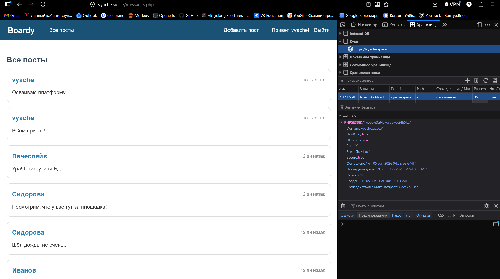
### 10. Параметры куки

Если мы уберем HttpOnly, то браузер даст возможность просматривать содержимое document.cookie с помощью JS. 
Злоумышленник может внедрить в сайт JS код, который просто украдет все данные из этого файла, тем самым получив куку и возможность входить под чужим аккаунтом

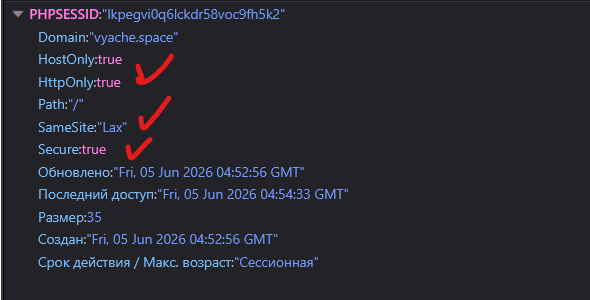
### 11. HttpOnly на практике

Потому что поле HttpOnly говорит браузеры закрыть доступ к document.cookie через JS, но все равно хранит куку у себя в БД

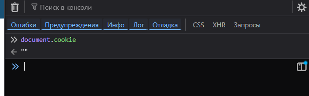
### 12. Файл сессии на сервере

У меня файлы сессии хранятся по другому пути, т.к в настройках php почему-то указано другое, с помощью команды на скрине нашёл нужное местоположение

В файле хранятся данные о айди и имени пользователя. Конфиденциальные данные мы храним на сервере, а в куке отдаем лишь непонятный для внешнего мира набор символов, это нужно для безопасности и защиты от возможной подделки ролей и т.п

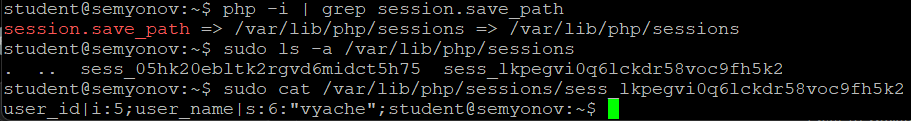
### 13. Защита страниц

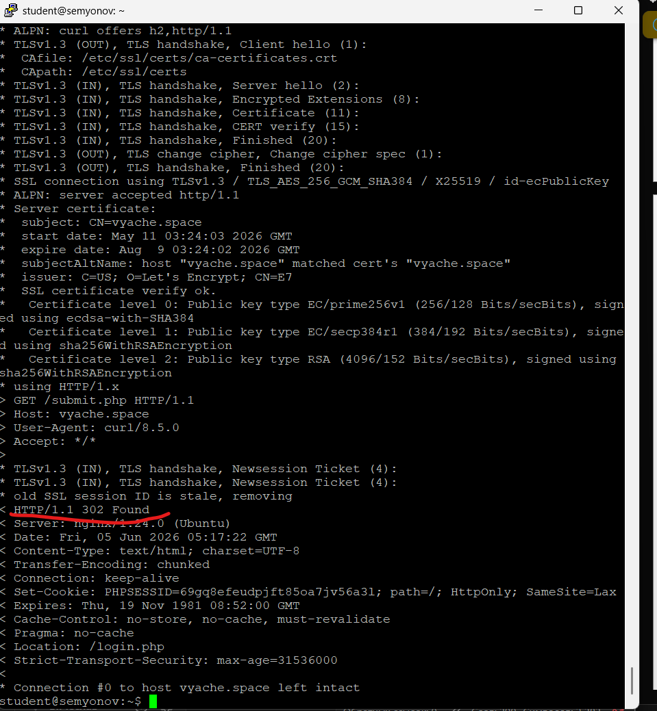
### 14. Посты с автором

```
$stmt = $pdo->query(
    'SELECT posts.body, users.name, posts.created_at
     FROM posts
     JOIN users ON posts.author_id = users.id
     ORDER BY posts.created_at DESC'
);
```
C Join мы оптимизируем соединение и избавляемся от N+1 запроса, когда для каждого юзера приходиться запрашивать еще его имя, тут же мы просто объединяем данные из 2 таблиц

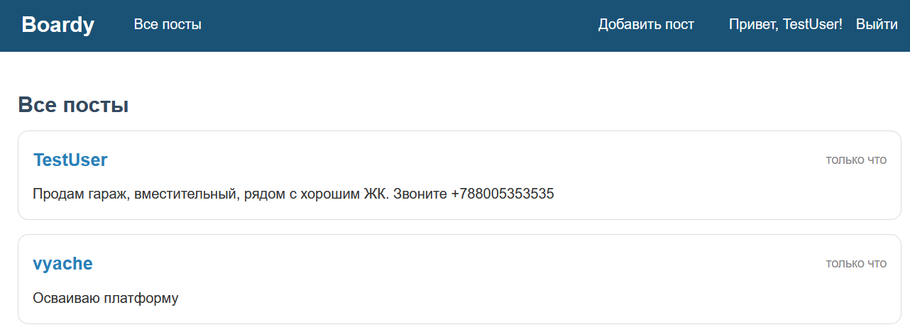
### 15. Добавление поста

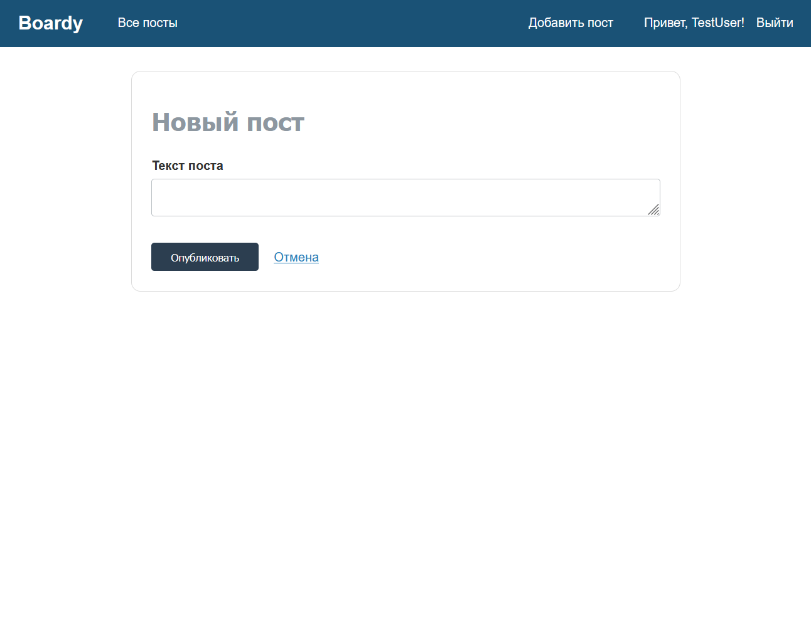
### 16. Logout

session_destroy удаляет файл сессии на сервере, но на клиенте кука остается, с помощью setcookie мы говорим клиенту установить новую с прошедшей датой, чтобы она сразу же сгорела. если оставить что-то одно, то мы либо удалим куку на клиенте, а на сервере останется, либо наобоорот

Однако у меня на скрине после логаута все равно есть кука, это происходит потому, что в /logout.php мы действительно правильно очищаем куку на клиенте и сервере, однако после этого сразу редиректим на /messages.php, поэтому там session_start() не видит сессию и сразу создаёт новую, отправляя клиенту новый PHPSESSID


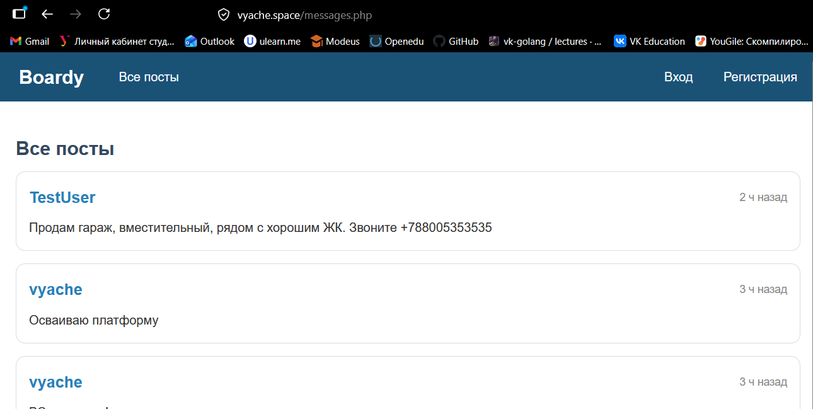
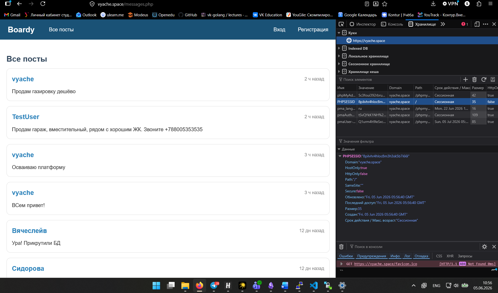
### 17. Истёкшая сессия

Потому что после авторизации мы создали куку на клиенте и сервере, но потом вручную удалили файл с сервера, а на клиенте то осталось. Поэтому когда мы заходим на /submit.php, в котором проверяем залогинен ли юзер, то php не видит у себя такую сессию, а потом редиректит на /login.php

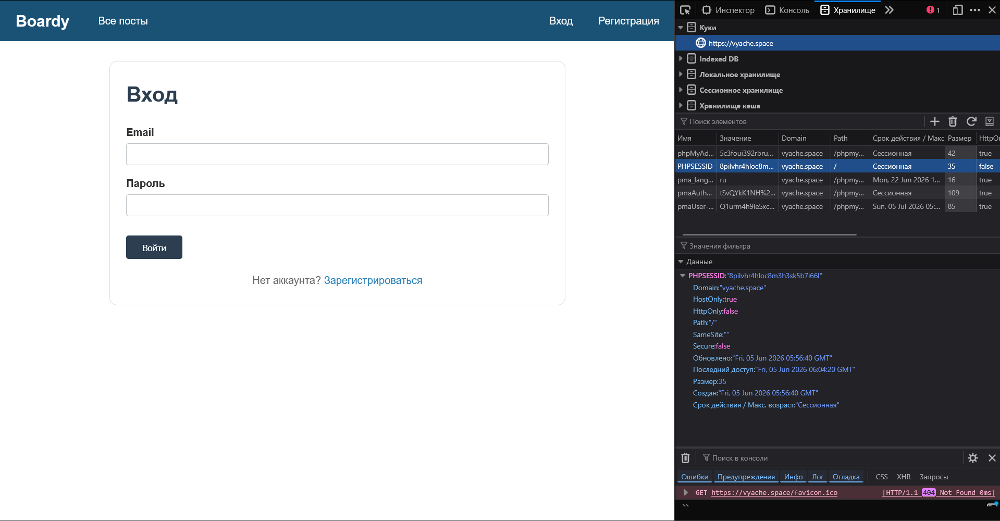
### Pull-request

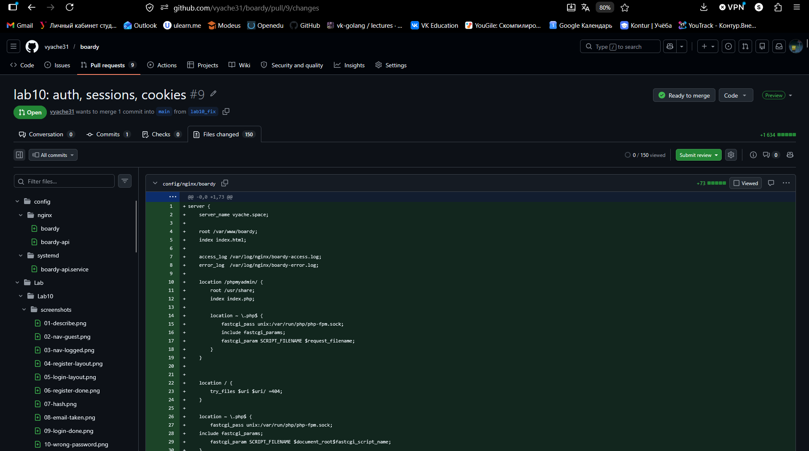
