# Отчёт к лабораторной работе №11 Семёнов В.А.
## JWT для API и OAuth через GitHub
### 1.  auth.py

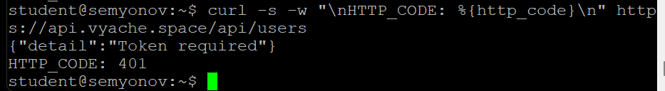
### 2. /api/me.php

Потому что задумывается, что пользователь уже успешно авторизован, поэтому отправлять его данные с запросом не нужно. PHPSESSID хранит айди, по которому мы храним соответствующие данные пользователя
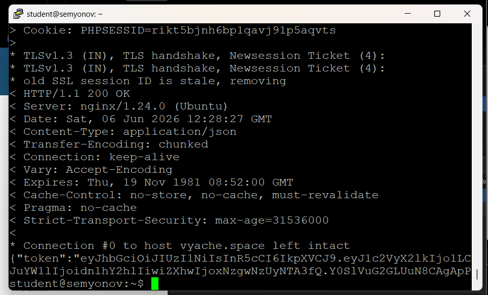
### 3. React получает JWT

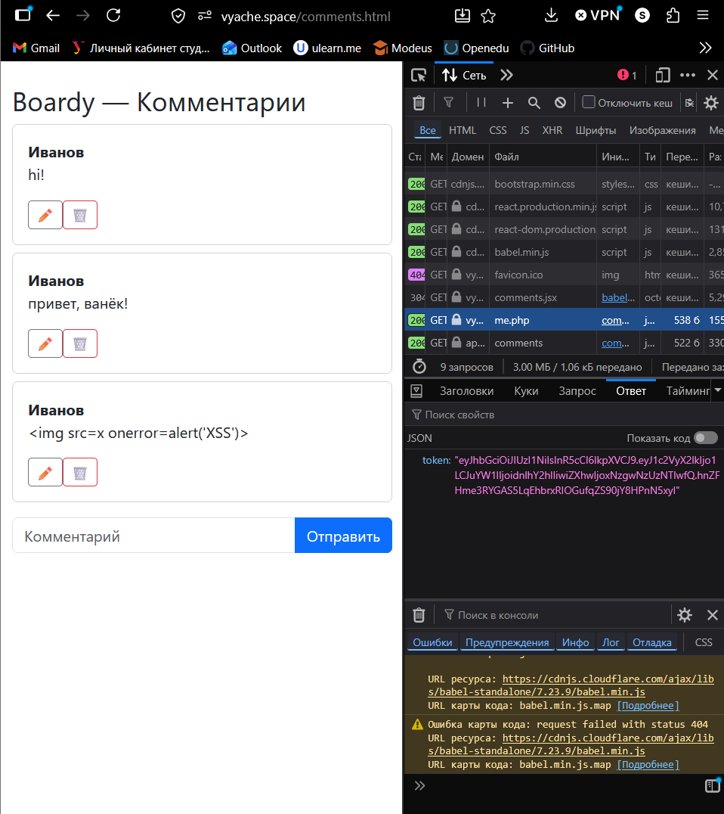
### 4. Bearer в запросах

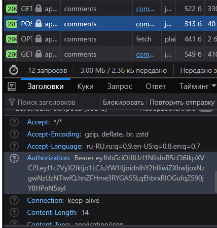
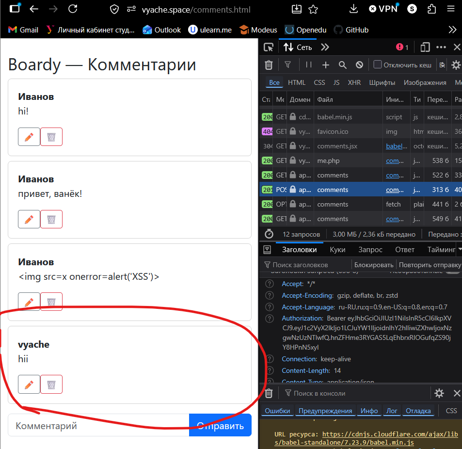
### 5. jwt.io

payload кодируется в base64url, если злодей перехватить его, то он с легкостью сможет его расшифровать и увидеть айди, имя и срок токена определенного юзера, но помимо этой инфы у него ничего не будет и подделать он не сможет, т.к секретный ключ лежит только на сервере и jwt подписывается им. ОДНАКО злодей сможет подделывать себя под пользователя до тех пор, пока токен не сгорит, поэтому нужны рефреш токены

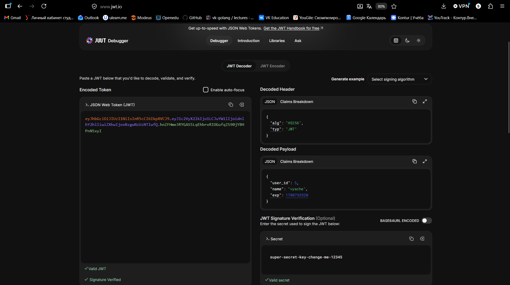
### 6. Истёкший токен

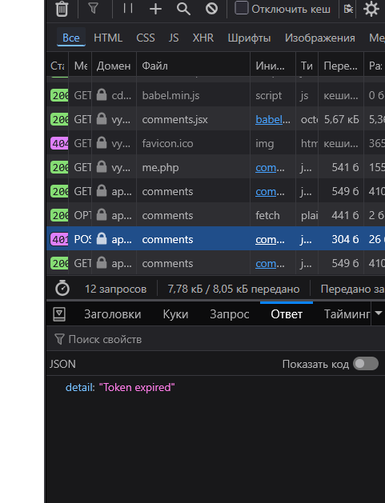
### 7. Невалидный токен

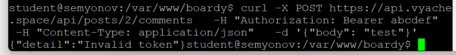
### 8. OAuth App на GitHub

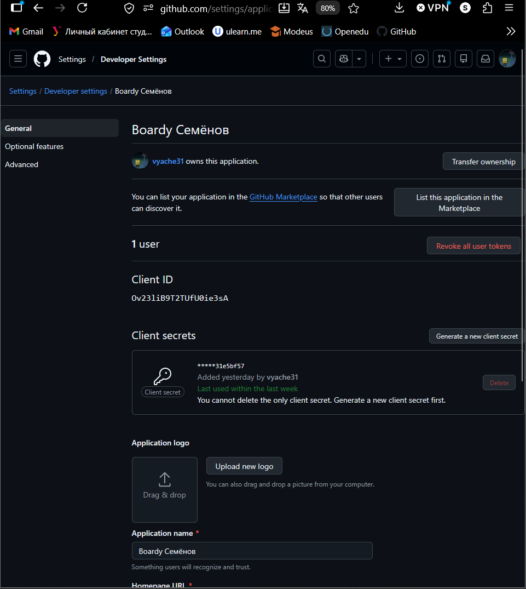
### 9. Столбец github_id

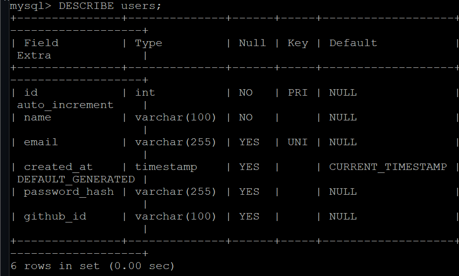
### 10. Кнопка «Войти через GitHub»

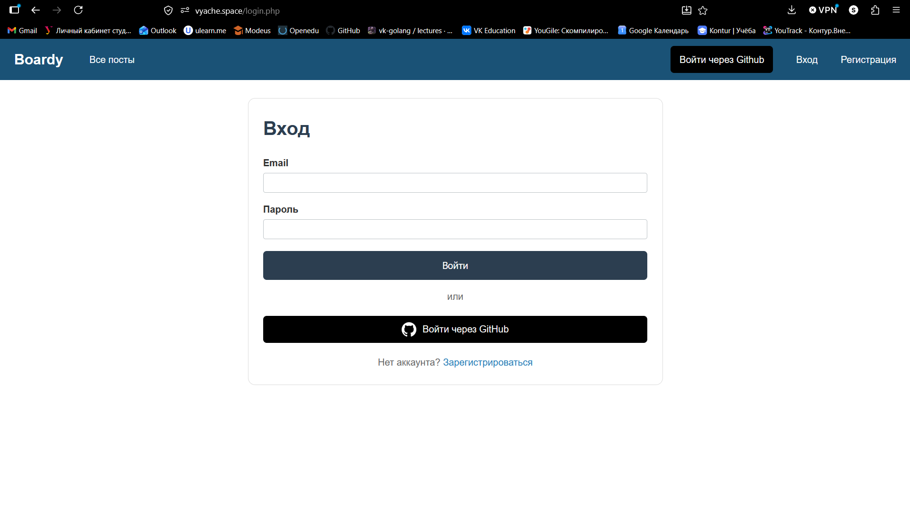
### 11. OAuth flow

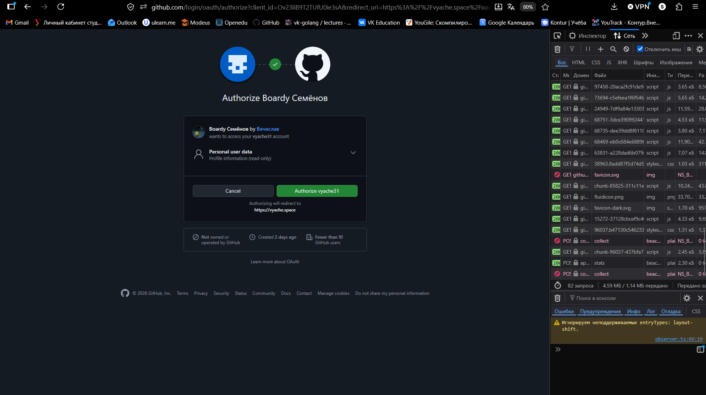
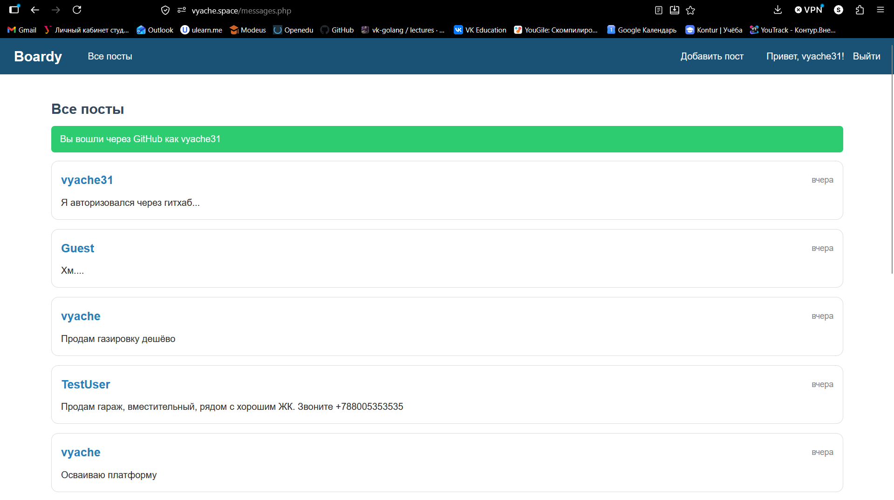
### 12. github_id в базе

потому что пользователь может включить приватность своей почты и мы ее не увидим, а айди гитхаб аккаунта точно одно и уникальное

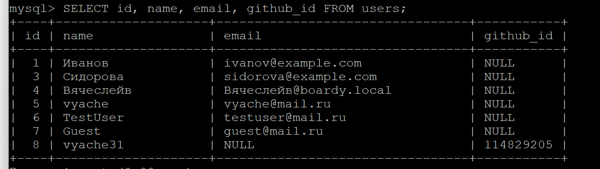
### 13. OAuth → JWT → API

1. Нажатие на кнопку, переход по ссылке /oauth-github.php
        ↓
2. В oauth-github мы формируем параметры: клиент_айди, куда редиректить после успешной авторизации, сохраняем состояние в сессию, и редиректим на гитхаб, указывая наши параметры
        ↓
3. Пользователь соглашается на стороне гитхаба, после чего тот редиректит на нашу ранее указанную ссылку /oauth-callback.php
        ↓
4. В oauth-callback мы отправляем запрос на гитхаб, чтоб тот выдал access_token, после чего мы запрашиваем с помощью токена данные о юзере и если такого юзера еще нет в БД, то добавляем, попутно добавляя в сессию данные и редиректим на /messages.php
        ↓
5. Наш пользователь заходит на страницу с комментами, а там реакт кидает запрос на /me.php, который проверяет есть ли данные в сессии, если да, то возвращает JWT и, если успешно, то отображаем комменты и даем возможность пользователю написать свой. Но комменты мы покажем в любом случае, т.к на этот эндпоинт не ставили зависимость от JWT

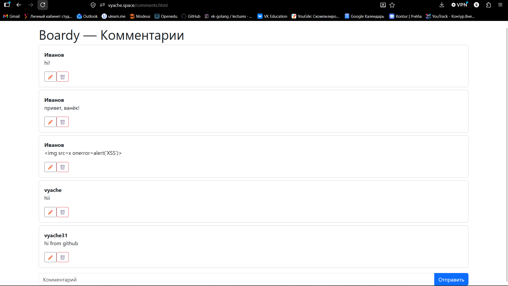
### 14. Параметр state

state это рандомная строка, которая формируется перед редиректом на авторизацию в сторонний сервис. После возврата с этого сервиса мы проверяем совпадает ли state, который мы сохранили перед отправкой

Сценарий CSRF атаки:
1. Злоумышленник заходит через гит 
2. сохраняет коллбэк ссылку с кодом
3. отправляет ссылку другому пользователю
4. тот пользователь переходит по ней и сервер получает данные от гитхаба злоумышенника
5. сессия пользователя меняется на сессию злоумышленника
6. пользователь думает, что он под своим аккаунтом, хотя это не так

### 15. Три способа входа

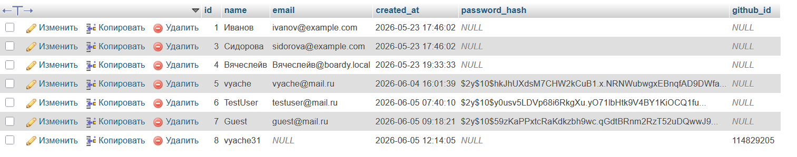
### 16. Сравнение механизмов

| Вопрос                     | Куки+сессии | JWT         | OAuth              |
| -------------------------- | ----------- | ----------- | ------------------ |
| Где хранятся данные?       | Сервер      | на клиенте  | у OAuth провайдера |
| Кто прикрепляет к запросу? | браузер сам | клиент      | Провайдер          |
| Для какого типа клиентов?  | Веб браузер | Для всех    | Внешние сервисы    |
| Можно ли отозвать?         | Да          | Нет         | Да                 |
| Кросс-доменно работает?    | Нет         | Да, вручную | Да                 |

### 17. Баги и пакеты

1. После истечения токена приходится логиниться заново. При продлении срока токена, в случае, когда токен может быть похищен, то мы ничего не сделаем, пока токен не сгорит сам. В этом помогают refresh токены, Passport дает их из коробки
2. Мы защищаемся от CSRF вручную, но вполне можем забыть об этом где-то и получить уязвимость на сайте. Socialite делает это сам
3. CLIENT SECRET хранится прямо в гит. Один случайный коммит и пуш в удаленный репозиторий - секрет скомпроментирован. Passport генерирует RSA и хранит их в файлах, которые мы кладем в .gitignore
4. 
