# Отчёт к лабораторной работе №13 Семёнов В.А.
## WebSocket: реалтайм-лента
### 1.  ConnectionManager

Потому что self.active это ссылки на актуальные TCP-сокеты, бд не умеет такое хранить. Поэтому при перезапуске Uvicorn список активных подключеный очистится

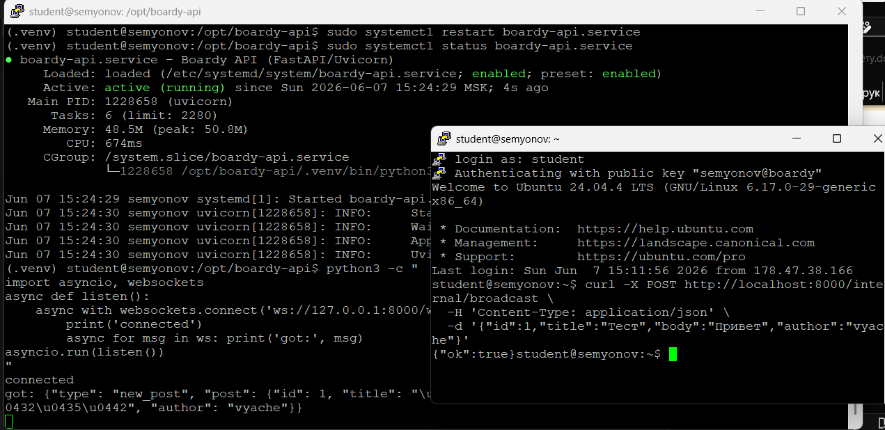
### 2. /internal/broadcast

Потому что это внутренний эндпоинт для ларавель, поэтому нет смысла защищаться с помощью JWT. Риск в том, что любой может кидать свои события, но Nginx дает возможность разрешить запросы к этому адресу только от локалхоста, а остальные запросы отклонять

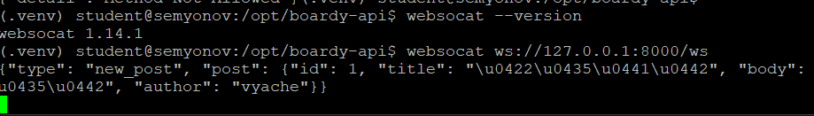
### 3. Два клиента

Если один из клиентов отключиться, то когда мы начнем отправлять его сообщение по вебсокету, то получим ошибку, с помощью except ловим ее и добавляем в dead список, потом эти соединения мы удаляем из списка активных.

в коде это обрабаывается в методе broadcast try/except

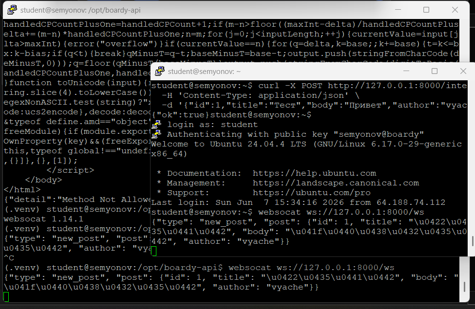
### 4. PostController

Таймаут нужен в том случае, если фастапи начнет вести себя непредсказуемо, то лаварель после ожидания завершит запрос и таким образом пользователь не увидит сильной задержки. Если же таймайута не будет, то лаварель будет ожидать ответа от фастапи и запрос у пользователя будет создаваться оочень долго, хотя по факту он уже давно создан

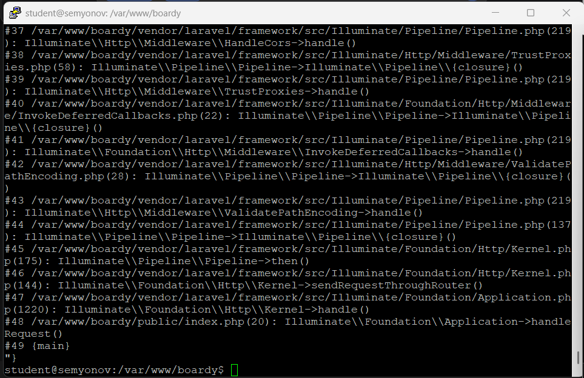
### 5. Проверка callback

HTTP-Callback костыль, т.к нормальным решением считается встраивать взаимодействие между сервиса посредством очереди или брокера. А мы сейчас реализовали непосредственное взаимодействие ларавеля и фастапи через адрес. 
Проблемы:
1. Если фастапи лег, то наше сообщение уходит вникуда
2. Если фастапи зависает, то зависает и поведение ларавеля
3. Ларавелю необходимо точно знать через какой интерфейс нужно взаимодействовать с фастапи

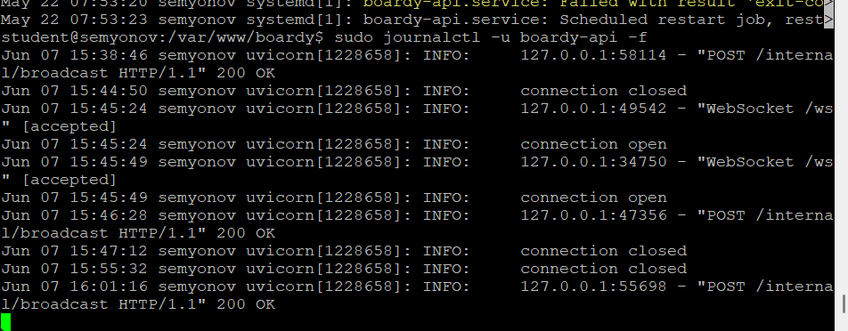
### 6. WebSocket в Blade

ws для обычного http, wss это TLS Websocket, шифруется также, как https. Если попытаться использовать wss без tls, то соединение не удастся, т.к браузер будет ждать шифрованный канал

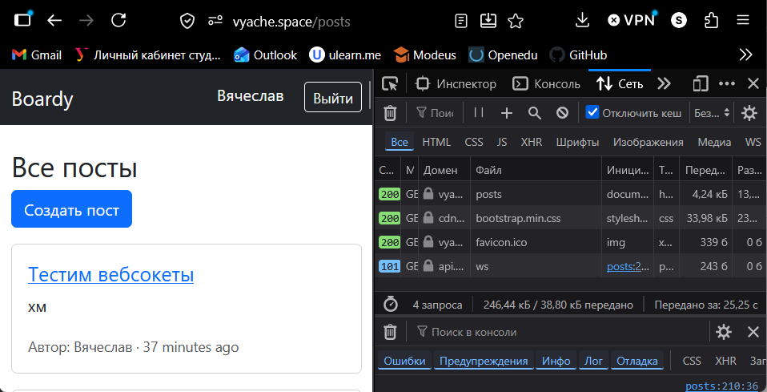
### 7. Два браузера

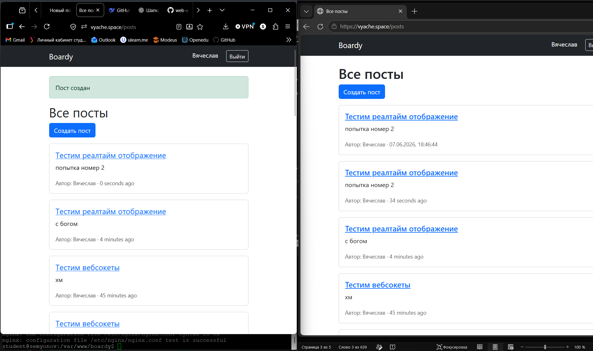
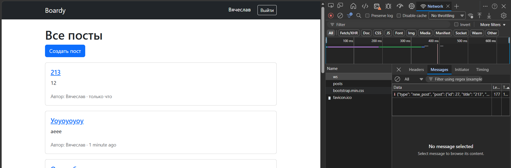
### 8. XSS

функция escapeHTML меняет символы на HTML теги по типу &gt и т.п. Если вставить данные напрямую, то браузер будет работать с ними как с HTML и выполнять его, таким образом это можно использовать для внедрения опасных скриптов на сайт

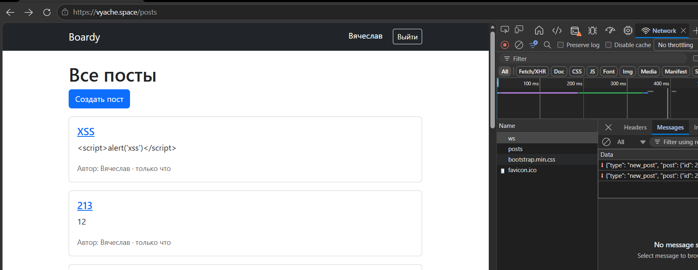
### 9. Переподключение

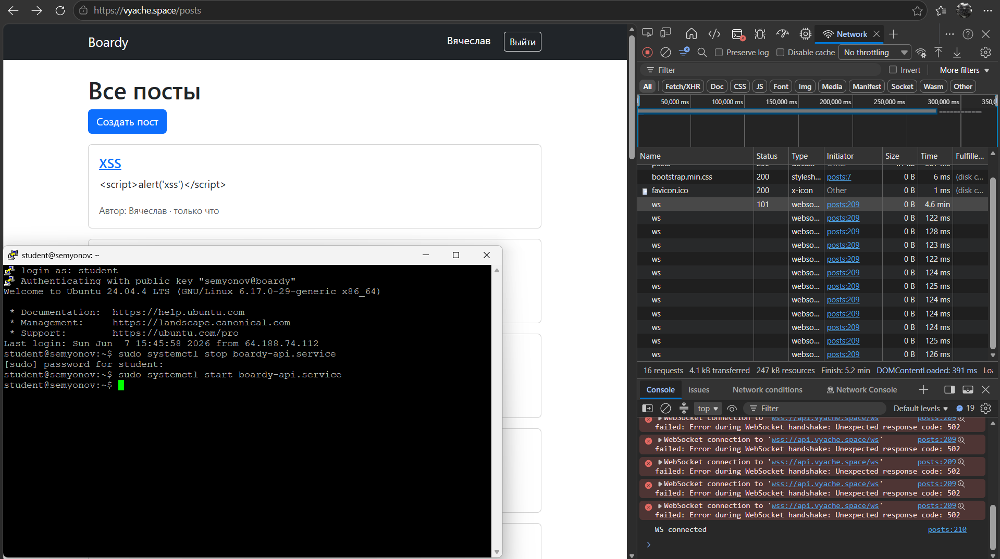
### 10. WS-проксирование

Если убрать proxy_http_version 1.1, то наш веб-сервер может взаимодействовать с соединениями в 1.0, но в протоколе вебсокетов Upgrade нормально работает только с 1.1
Если убрать proxy_set_header Upgrade, то nginx передаст приложению запрос без заголовка и оно не поймет, что клиент хочет подключиться по вебсокету.
Если убрать proxy_read_timeout, то nginx при долгом молчании будет разрывать соединение 

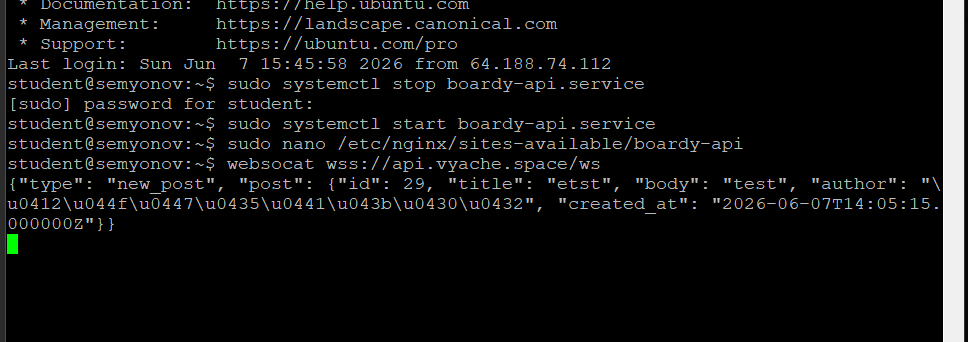
### 11. Закрыть /internal

он опасен, т.к с помощью этого адреса мы отправляем сообщения всем активным подключениям, если его можно дергать снаружи, то любой может засорить канал

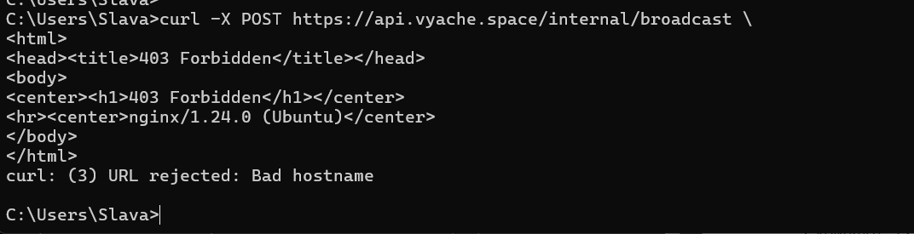
