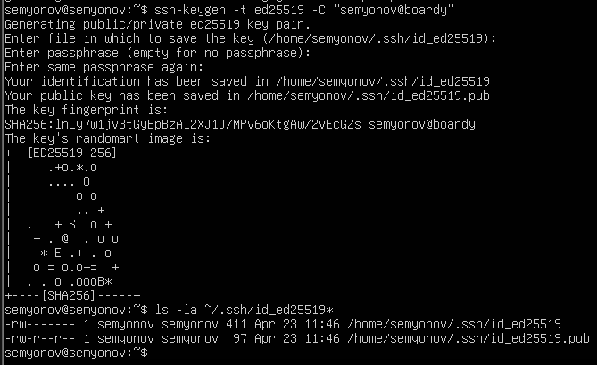
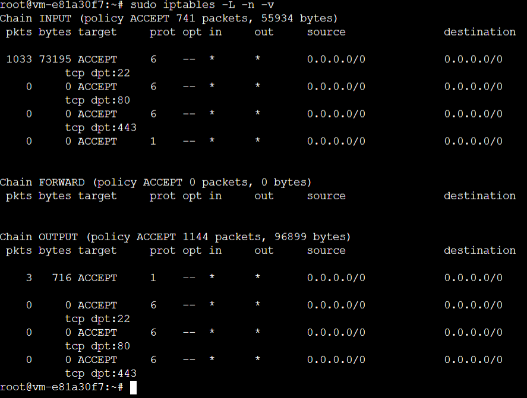
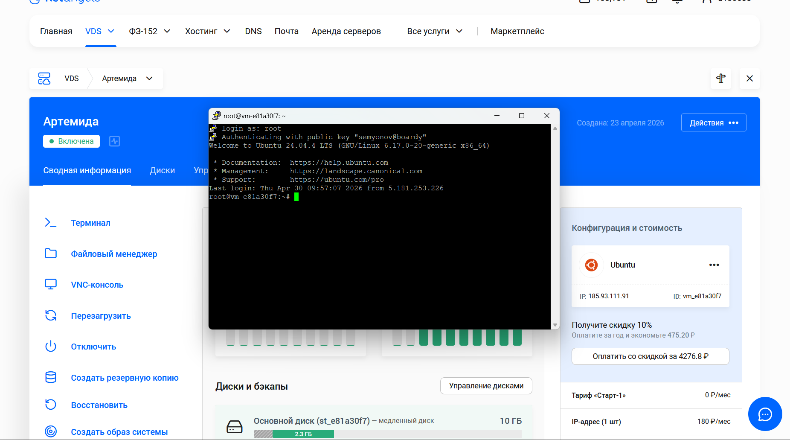
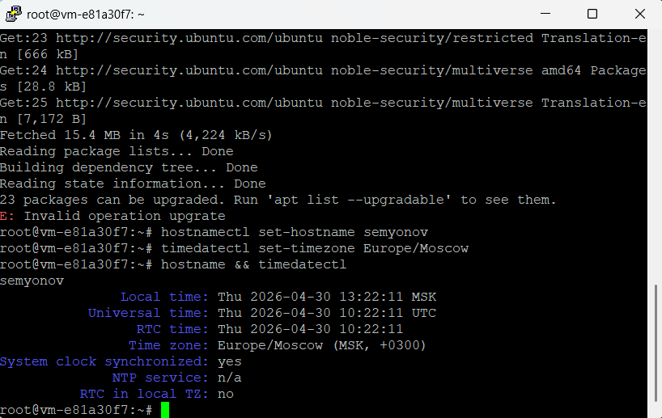
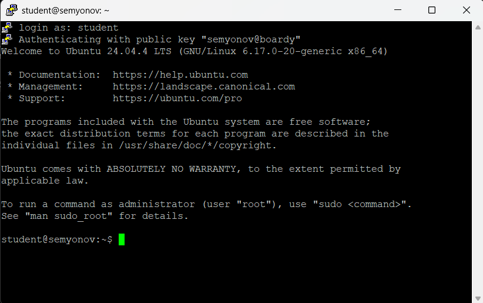
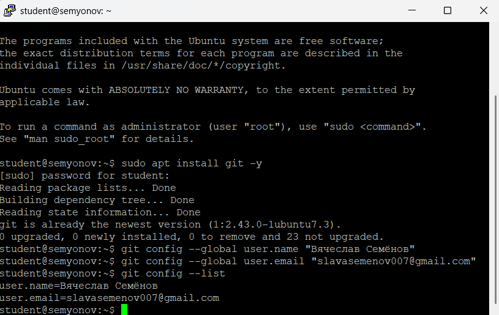
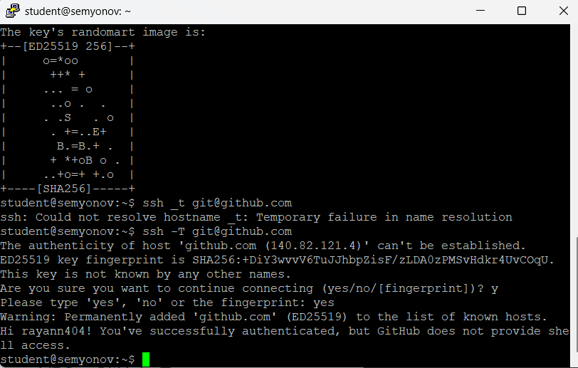
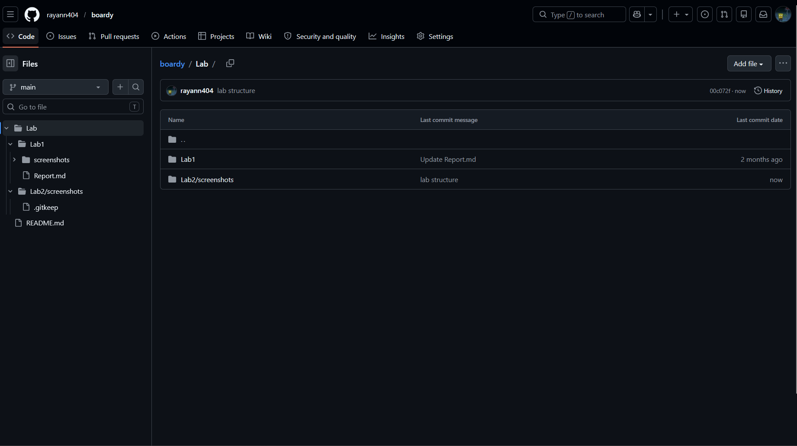
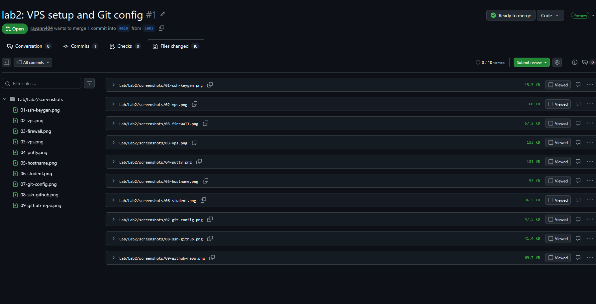

# Отчёт к лабораторной работе №2 Семёнов В.А
## Подключения и настройка VPS
### 1. SSH-ключ

---
### 2. VPS и файрвол

---
### 3. Подключение через PuTTY

---
### 4. Настройка сервера

---
### 5. Пользователь student

---
### 6. Git и SSH-ключ → GitHub

---
### 7. Репозиторий и структура

---
### 8. Ветка и Pull Request

