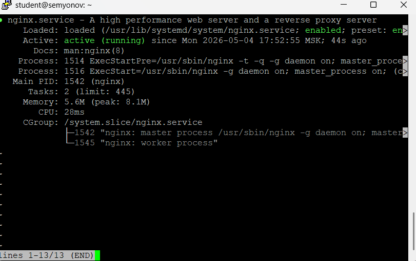
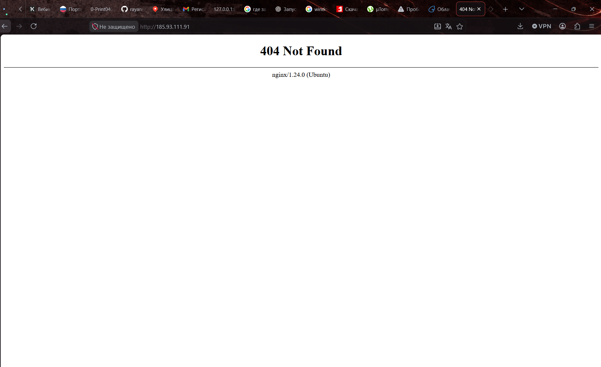
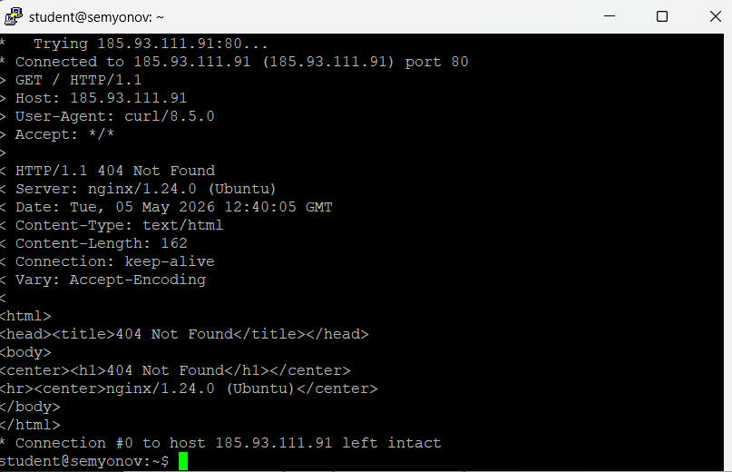
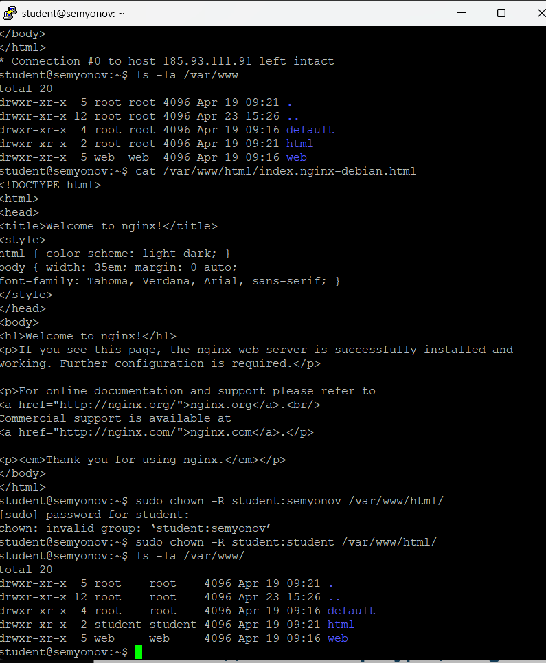
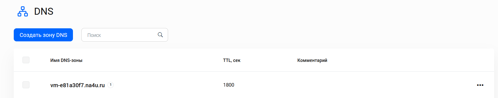
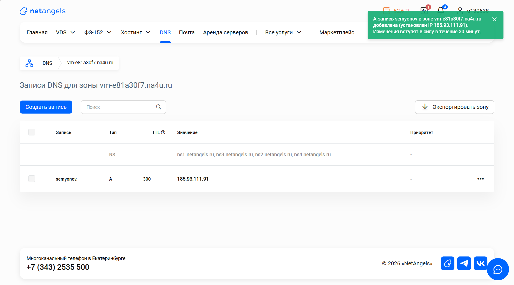
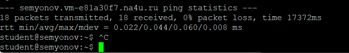
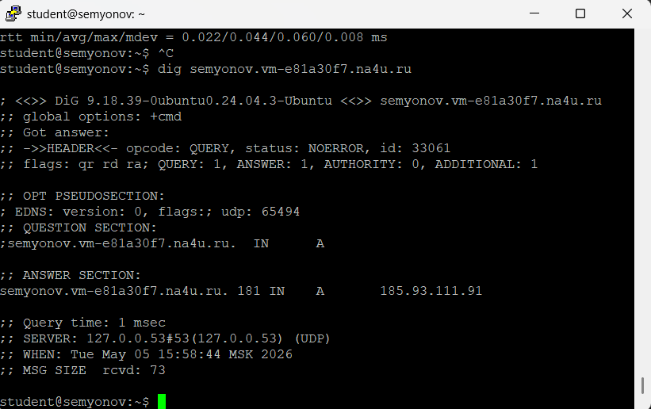
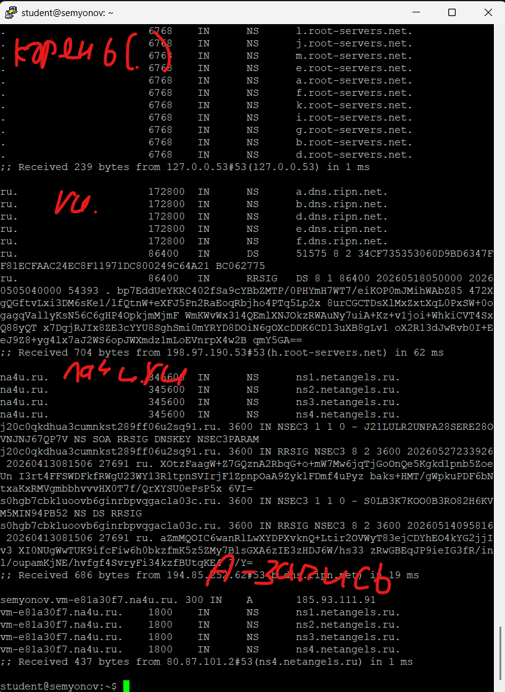
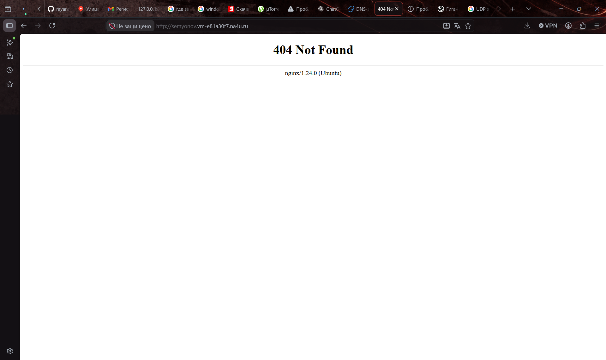

# Отчёт к лабораторной работе №3 Семёнов В.А
## Nginx & DNS
### 1. Установка Nginx

---
### 2. Страница по IP

---
### 3. Curl

---
### 4. Директория и права

---
### 5. Конфигурация Nginx
#### listen

- listen 80 default_server;
- listen [::]:80 default_server;
- значение порта, с которого nginx принимает входящие соединения

#### root
- /var/www/html
- папка, из которой он берет файлы
#### server_name
- __
- указывает домен, для которого nginx используется

#### index
- index.html index.htm index.nginx-debian.html;
- файл, который он отдает по умолчанию для GET /
---
### 6. DNS-зона

---
### 7. A-запись

---
### 8. ping

### 9. dig

### 10. dig +trace
```
; <<>> DiG 9.18.39-0ubuntu0.24.04.3-Ubuntu <<>> semyonov.vm-e81a30f7.na4u.ru;; global options: +cmd;; Got answer:;; ->>HEADER<<- opcode: QUERY, status: NOERROR, id: 33061;; flags: qr rd ra; QUERY: 1, ANSWER: 1, AUTHORITY: 0, ADDITIONAL: 1`

;; OPT PSEUDOSECTION:; EDNS: version: 0, flags:; udp: 65494
;;QUESTION SECTION:
;semyonov.vm-e81a30f7.na4u.ru.  IN      A

;; ANSWER SECTION:
semyonov.vm-e81a30f7.na4u.ru. 181 IN    A       185.93.111.91

;; Query time: 1 msec
;; SERVER: 127.0.0.53#53(127.0.0.53) (UDP)
;; WHEN: Tue May 05 15:58:44 MSK 2026
;; MSG SIZE  rcvd: 73
```
#### QUESTION SECTION (что спросили):
- semyonov.vm-e81a30f7.na4u.ru. -- домен хоста
- IN -- тип запроса
- A -- тип DNS записи
#### ANSWER SECTION (IP + TTL):
- semyonov.vm-e81a30f7.na4u.ru. -- домен хоста
- 181 -- TTL
- А -- тип DNS записи
- 185.93.111.91 -- ответный IP
#### SERVER (кто ответил):
- 127.0.0.53#53(127.0.0.53) -- айпи локального DNS сервера, который обработал запрос
- (UDP) -- протокол передачи данных

### 11. Site by domain

