# Отчёт к лабораторной работе №3 Семёнов В.А
## Nginx & DNS
### 1. Директория проекта
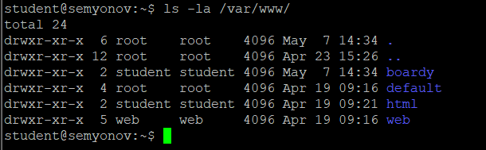
---
### 2. Конфиг виртуального хоста
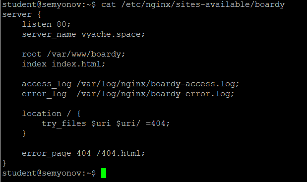
---
### 3. Landing
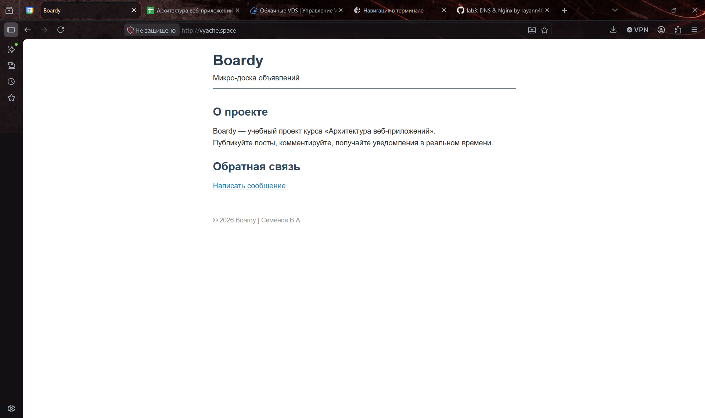
---
### 4. Форма обратной связи
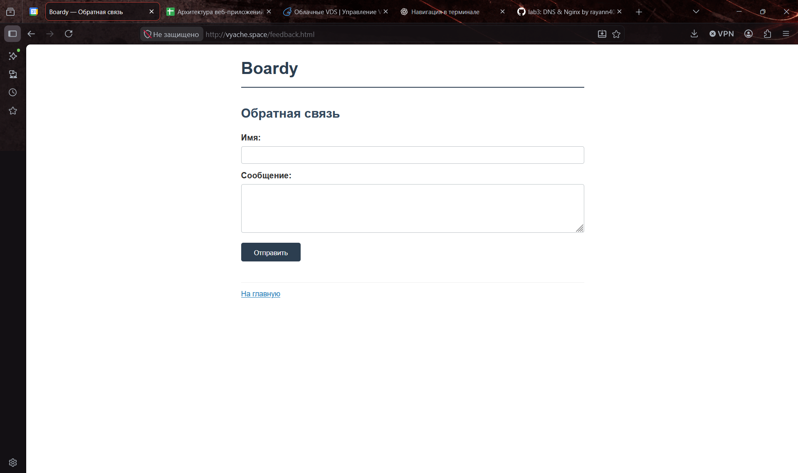
---
### 5. Стили и 404
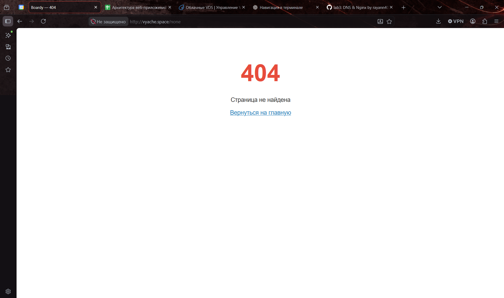
---
### 6. DNS-запись для поддомена
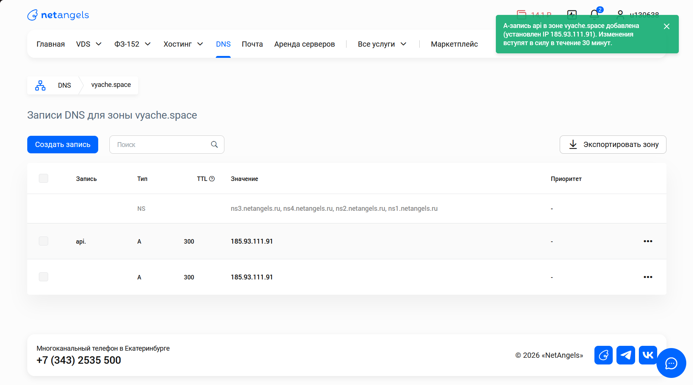
---
### 7. Проверка DNS
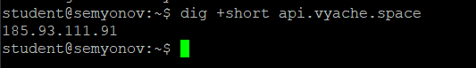
---
### 8. Конфиг и заглушка API
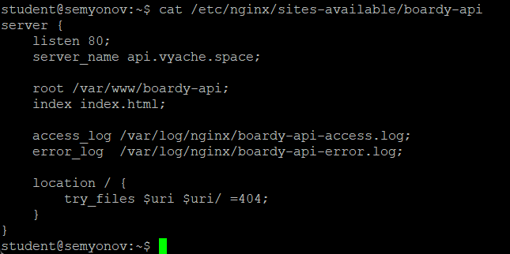
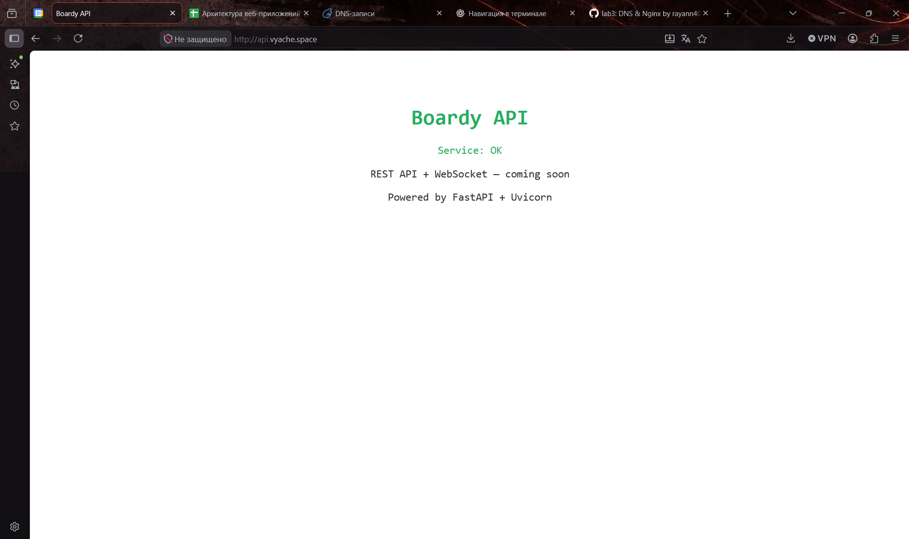
### 9. GET-запрос через curl -v
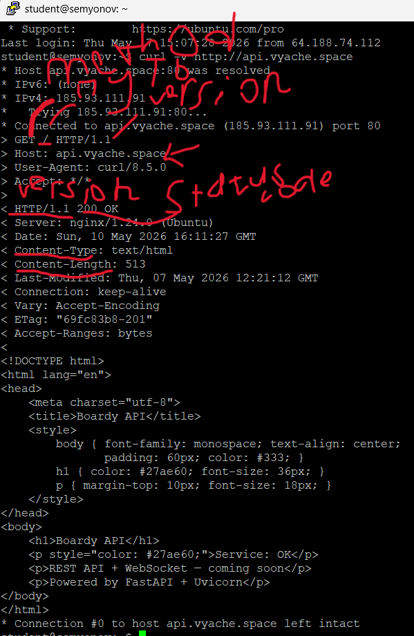
### 10. Виртуальные хосты в действии
Один айпи возвращает разные страницы, потому что в заголовке запроса мы явно указываем адрес хоста, с которого идет запрос, а наш nginx имеет 3 конфига, где указаны server_name наши vyache.space, api.vyache.space, -. Именно поэтому, когда nginx ловит запрос, он фильтрует по хосту и отправляет те файлы, которые мы указали в конфигурации.
Однако в первый раз, указав неизвестный хост, мне прилетела базовая страница боарди. Немного полазив в etc/nginx/ я увидел, что в sites-enabled/ у меня лежит только boardy, boardy-api. Именно поэтому, когда nginx ловил незаданный хост, то он обращался к самому первому конфигу в папке включенных. После того, как я указал в sites-enabled также default, где server_name указал пропуском, то наш nginx на все остальные хосты стал выдавать приветственную страницу nginx
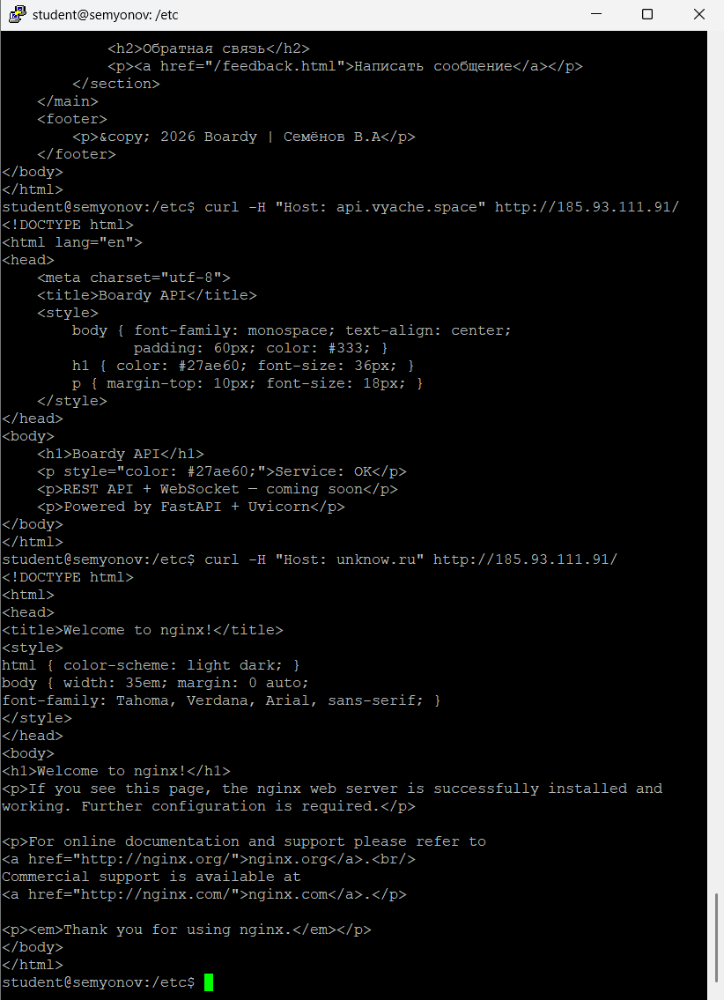
### 11. POST-запрос
Вообще, изначально на данный запрос мне прилетало 404, поэтому я вручную в конфиге указал /location и указал return 405. Однако потом задумался, мол, а какой смысл тогда объяснять почему прилетает 405, если для этого мы просто сами должны это явно прописать. Пообщавшись по этому поводу с GPTшкой, я пришел к выводу, что когда мы обращаемся к /submit, то Nginx смотрит на location в конфиге, если там ничего нет, то идёт смотреть в файлы и если там тоже ничего нет, как в нашем изначальном случае, то возвращает 404. По сути, да, nginx сам обрабатывать пост запросы не может, однако если /submit вооьще не существует, то вполне логично, что прилетает 404. 

На данном этапе не совсем понял, что именно вы подразумевали под этим шагом и почему на самом деле при нашей конфигурации nginx должен возвращать 405?
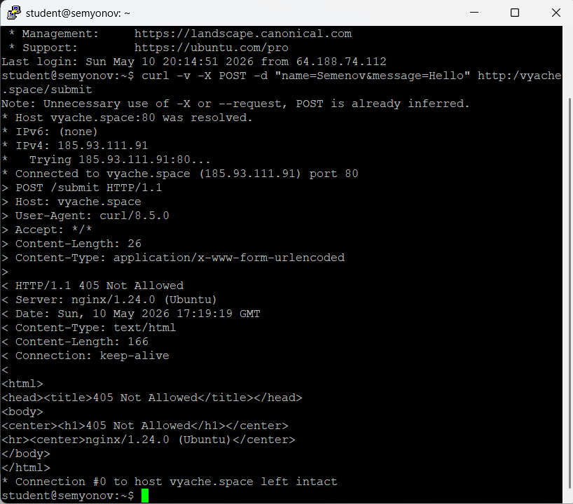
### 12. Head-запрос
Такой запрос присылает только заголовки, нужен для проверки размера, типа и вообще существует ли
### 13. Раздельные логики
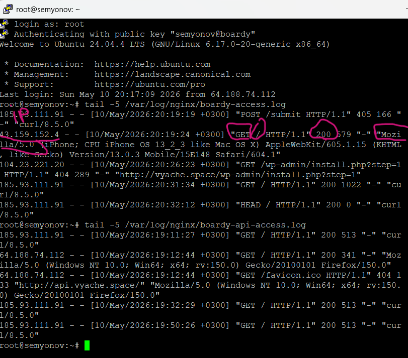
### 14. Фильтрация логов
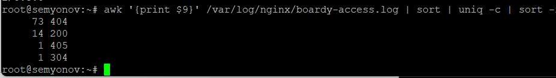
### 15. PR
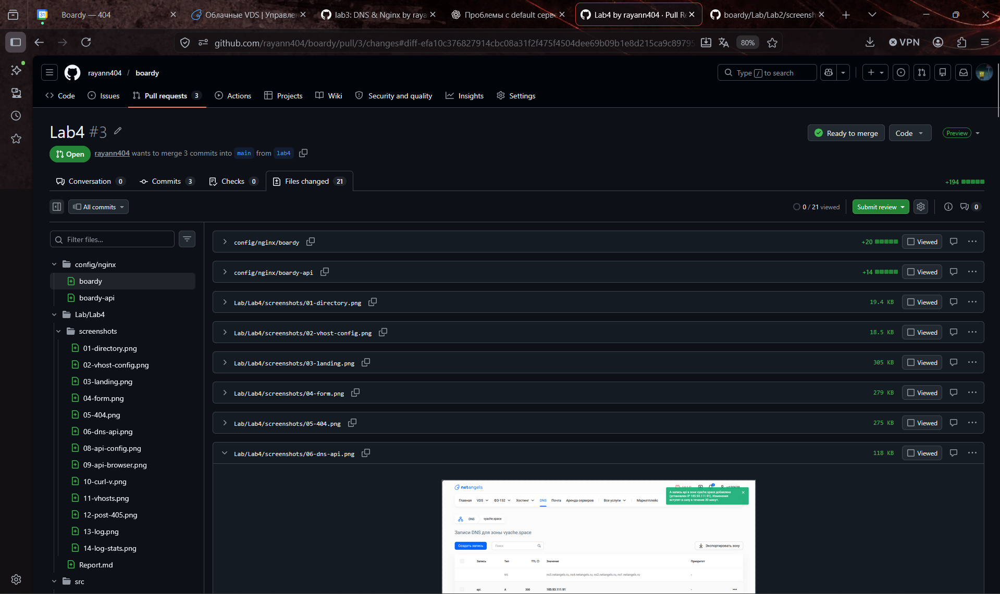
