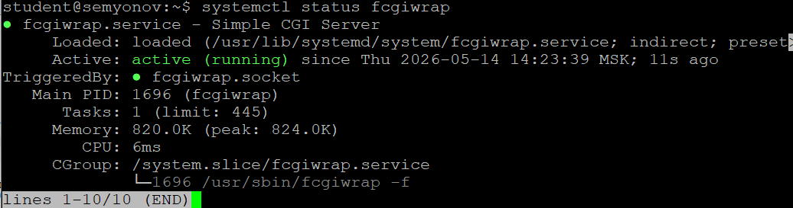
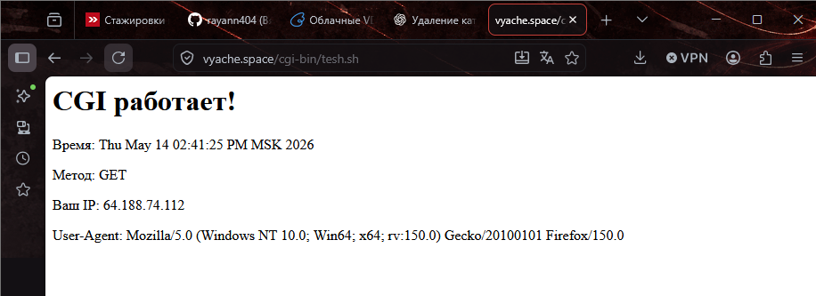
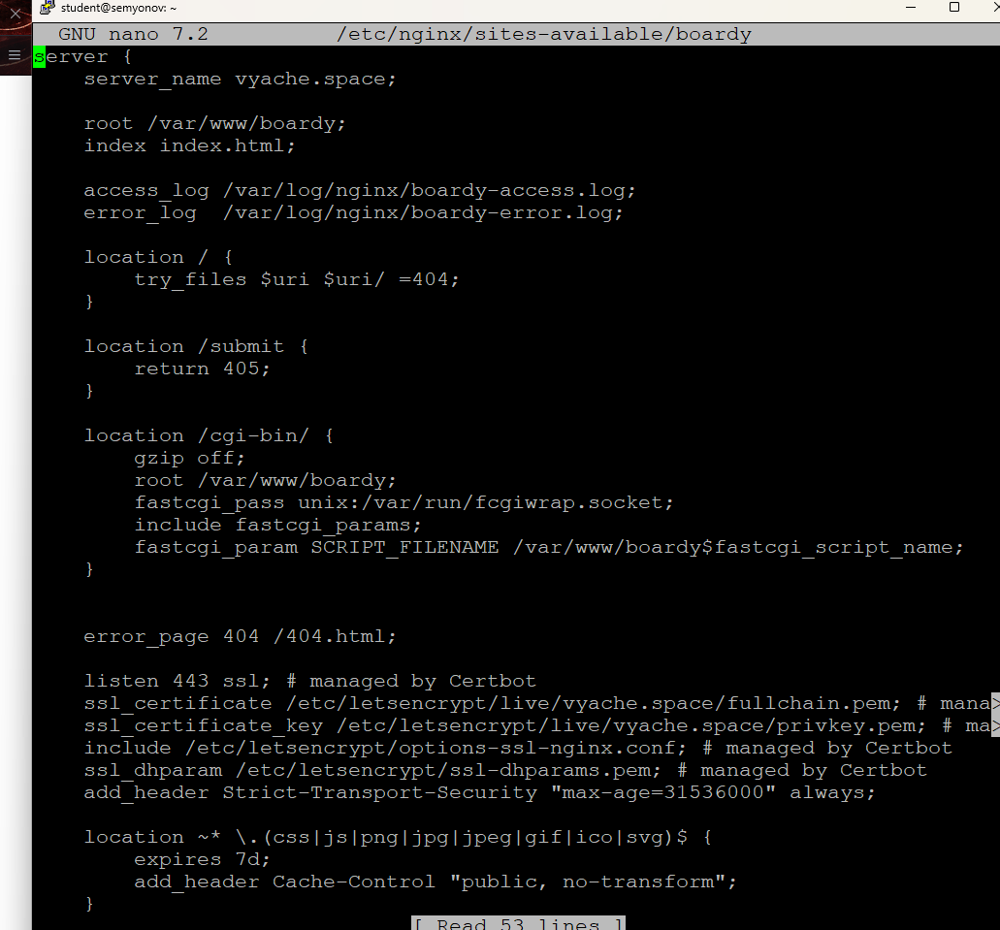
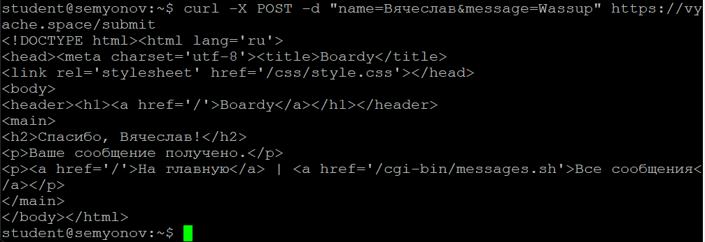
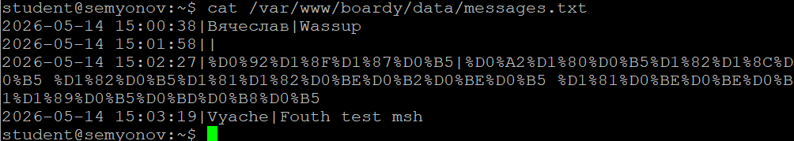
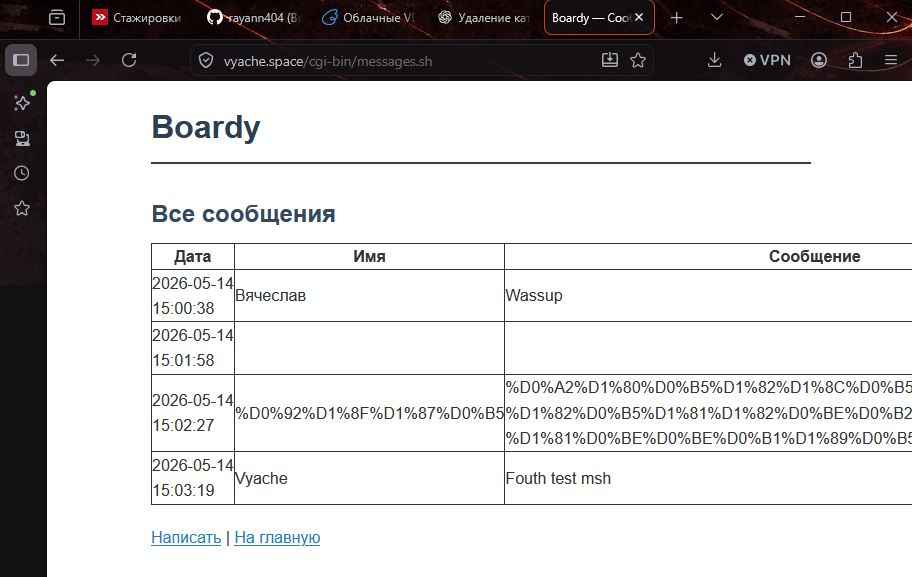
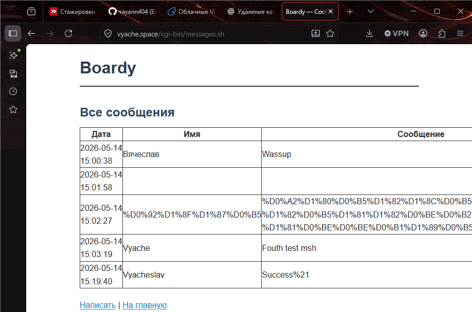
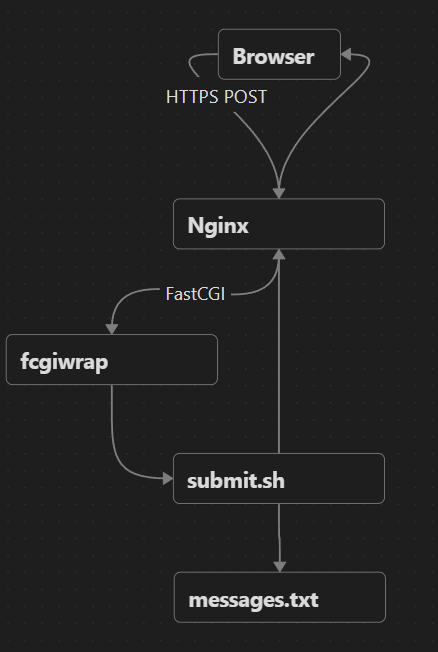
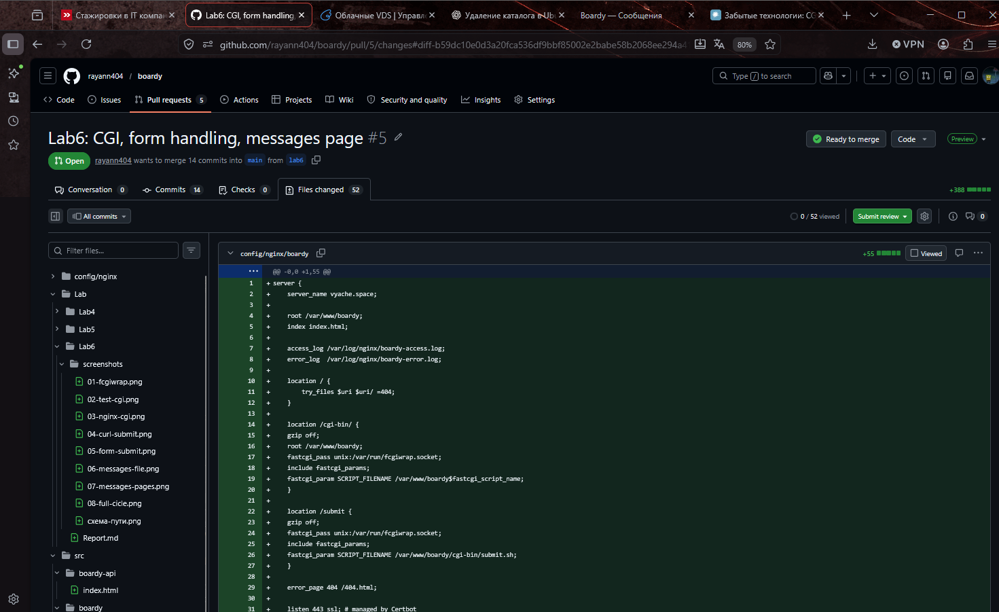

# Отчёт к лабораторной работе №6 Семёнов В.А.
## CGI и обработка форм (Nginx + fcgiwrap)  
### 1. Установка fcgiwrap

### 2. Тестовый CGI-скрипт

### 3. Конфигурация Nginx для CGI
fastcgi_pass - указывает сервису fcgiwrap путь до unix socket
include fastcgi_params - подключает FastCGI параметры, такие как метод запрос, айпи клиента, user-agent, query string, host, protocol
SCRIPT_FILENAME - путь к CGI скрипту, где название подставляет в зависимости от того, какой путь открыл пользователь. Если он открыл cgi-bin/test.sh, то $fastcgi_script_name будет /cgi-bin/tesh.sh

### 4. Скрипт обработки формы

### 5. Форма в браузере

### 6. Данные на диске
Браузер отправляет кириллицу в URL кодировке, поэтому если вбивать в форму текст на русском языке, то он превращает в набор непонятных символов, т.к наш CGI скрипт обрабатывает query string, лишь спарсив name & message, без декодирования из URL

### 7. Скрипт вывода сообщений

### 8. Полный цикл

### 9. Путь запроса
Схема приведена на скрине

### 10. Теория
1. Что такое CGI и какую проблему он решил в 1993 году?
CGI - Common Gateway Interface. До 93 года сайты могли только выдавать статические страницы, то есть, по сути, были лишь некими наборами готовой информации. Однако с появлением CGI сайты смогли динамически изменять информацию на сайтах
2. Как CGI скрипт получает данные POST запроса?
CGI получал данные либо из метаданных переменных окружения, которые формировала unix, либо напрямую в stdin через тело запроса
3. Почему CGI создает проблемы при высокой нагрузке?
Каждый запрос -> создание процесса, загрузка интерпретатора, запуск скрипта. Из-за этого при большом кол-ве запросов железо не выдерживало
4. Чем отличается fastcgi_pass от proxy_pass.
FastCGI_pass отдает уже обработанный HTTPS метод по FastCGI протоколу, когда proxy_pass повторно через nginx отдает голый HTTP метод, который 2 веб сервер уже обрабатывает
5. Зачем нужен fcgiwrap, если Apache запускает CGI напрямую?
Он нужен потому, что Nginx не умеет запускать скрипты напрямую, как это делает апач. Поэтому fcgiwrap выступает в качестве посредника. Nginx передает запрос через fastcgi сокет, fcgiwrap получает его и запускает скрипт, а затем возвращает результат
### 11. PR

