# Отчёт к лабораторной работе №7 Семёнов В.А.
## PHP-FPM + FastAPI
### 1. Установка PHP-FPM
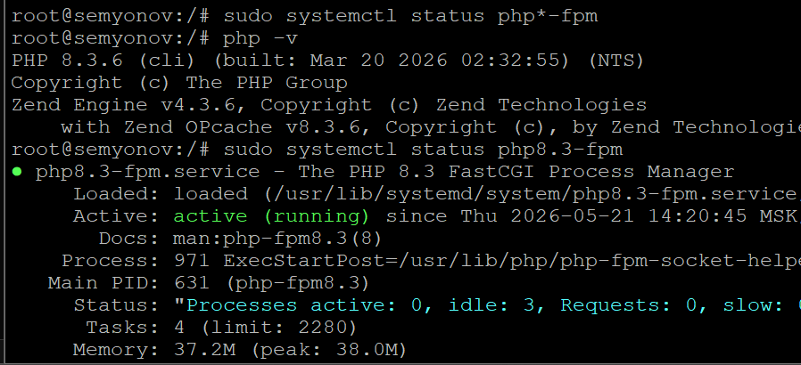
### 2. Форма и сообщения на PHP
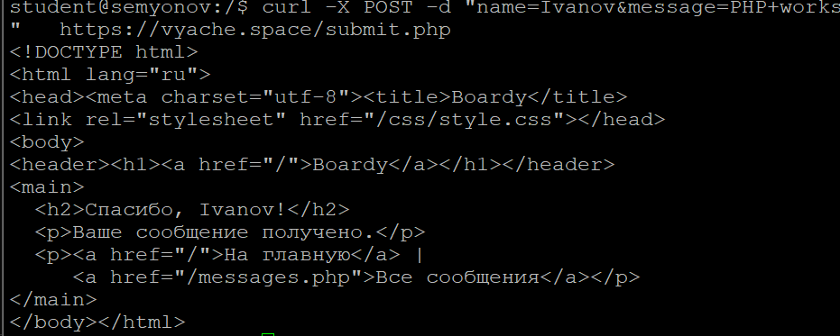
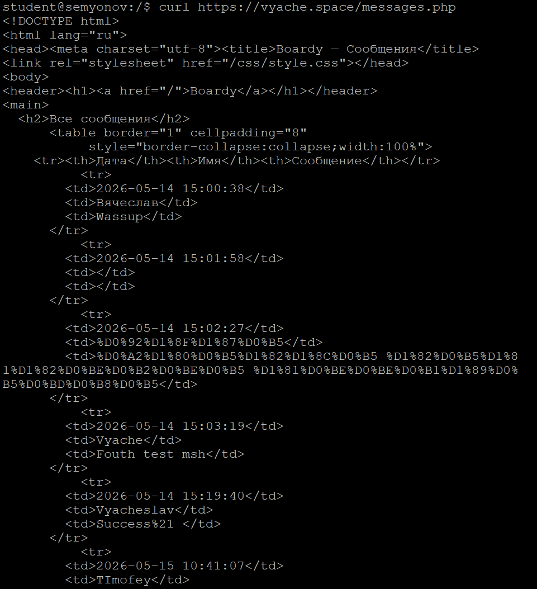
### 3. Конфиг Nginx для PHP

CGI через fcgiwrap это просто обертка CGI в FastCGI, однако он все ещё создает fork на каждый запрос. 
Fastcgi_pass же подключается через unix или tcp сокет в 1 процесс, который как раз ждет все запросы и обрабатывает их
PHP-FPM быстрее, потому что это настоящий менеджер процессов, у него есть набор воркеров, между которыми распределяются запросы уже в одном постоянном процессе, не нужно загружать php на каждый запрос

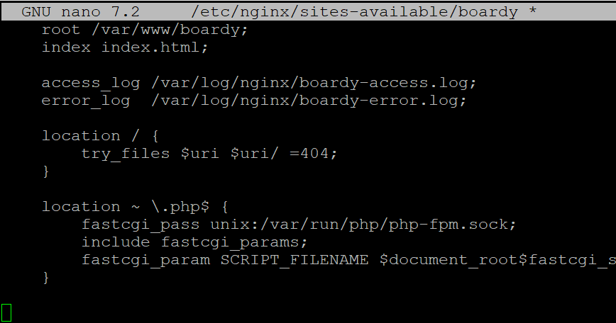
### 4. Shared nothing

Потому что переменные не передаются между запросами, т.к каждый запрос изолирован.
Shared nothing это архитектурный принцип, который гласит об автономности процессов, т.е каждый из них имеет собственную память и не зависит от других

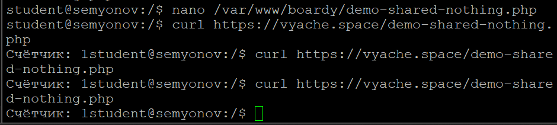
### 5. Блокировка воркеров

Каждый воркер обслуживает один запрос. sleep(2) блокирует воркер на 2 секунды. Если воркеров 5, а запросов 10 — первые 5 за 2 сек, вторые 5 ждут в очереди, итого ~4 сек.

Время выполнения заняло 5.3с
У PHP-FPM 4 воркера
Каждый воркер может обрабатывать один запрос, sleep(2) заставляет его ждать 2 секунды и только после этого он может брать следующий запрос. У нас 4 воркера, поэтому первые 4 за 2 сек, вторые 4 за еще 2 сек + последние два итого ~5.5с

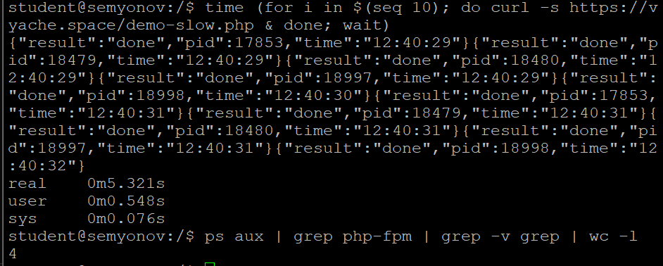
### 6. Установка и приложение
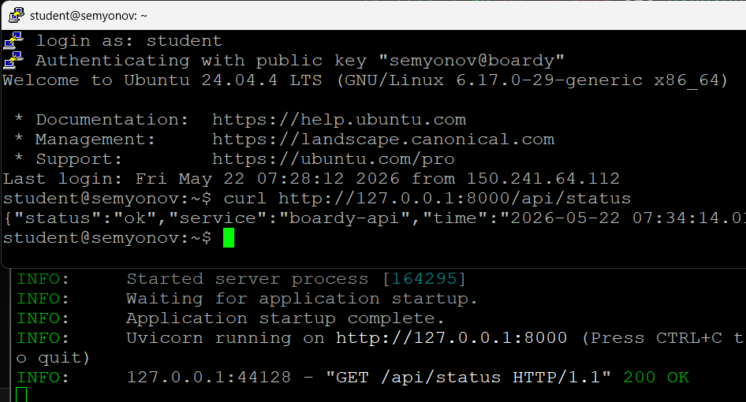
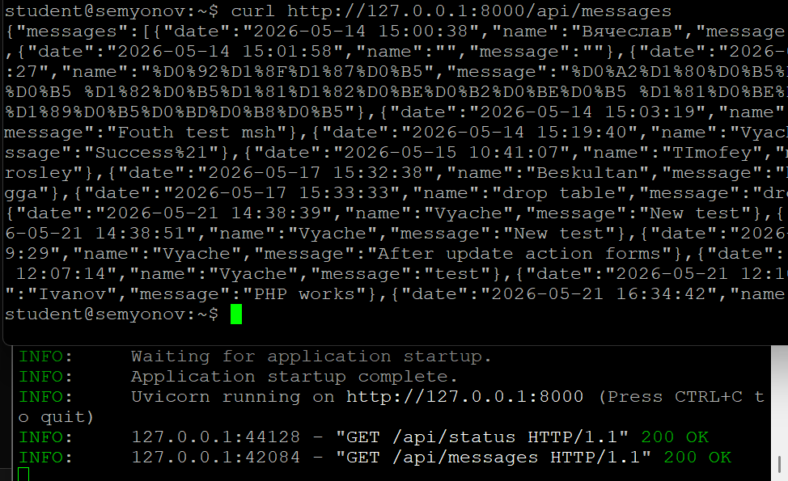
### 7. Живой процесс (счётчик)

Потому что uvicorn не убивает состояние после запроса, т.к все происходит в одном питоновском процессе, когда php-fpm использует изолированные воркеры для обработки каждого запроса

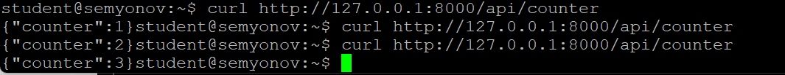
### 8. Async: 10 запросов за 2 секунды

Потому что event loop обработал все 10 запросов параллельно, без последовательных воркеров

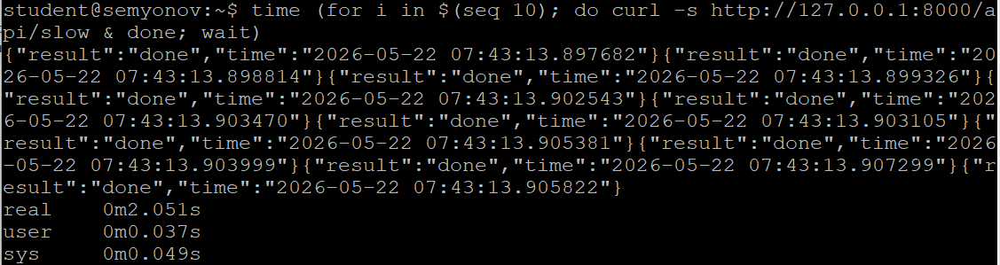
### 9. Блокирующий код убивает event loop

Потому что в slow-blocking используется time.sleep(), который полностью блокирует event loop и не дает обработать запросы параллельно, как asyncio.sleep

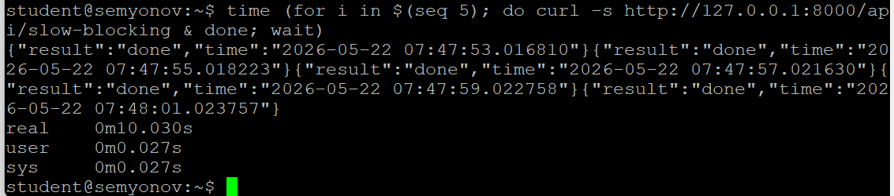
### 10. Swagger
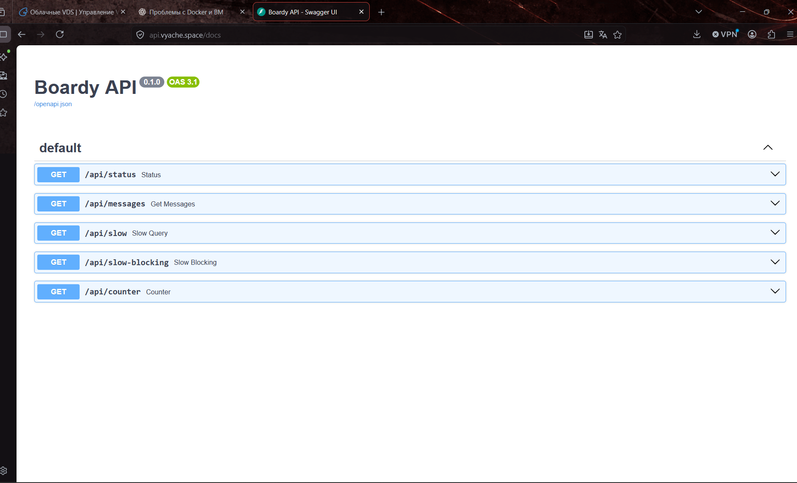
### 11. systemd-service
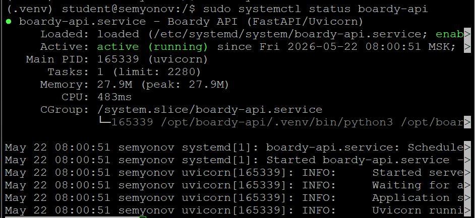
### 12. Nginx proxy_pass

proxy-pass это протокол взаимодействия, когда nginx прокидывает тот же http запрос веб серверу uvicorn и тот в свою очередь роутит запрос, а fastcgi_pass это когда nginx ловит http запрос и в FASTCGI протоколе передает в PHP-FPM уже обработанный с метаданными или query params.
Для PHP используется fastcgi_pass, потому что он не стал придумывать для себя свой уникальный веб сервер, в отличие от питона

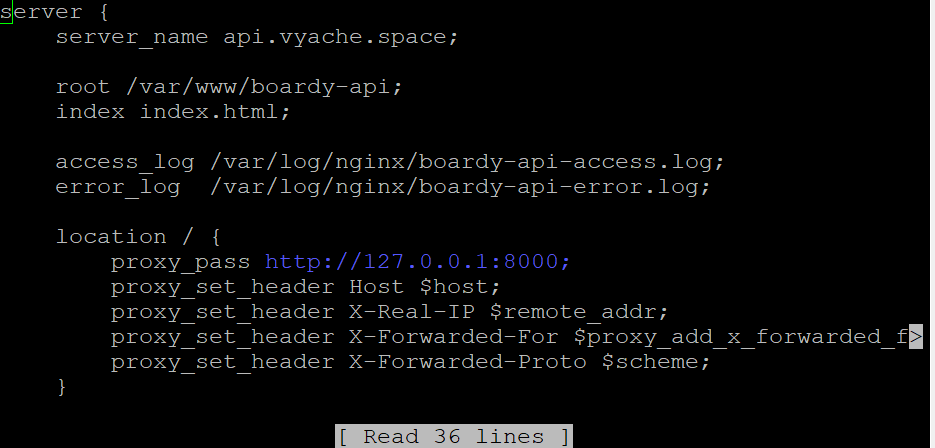
### 13. Два формата

PHP-FPM выдает данные в HTML формате, т.е готовые страницы, а FastAPI выдает данные в JSON. Первый вариант можно без проблем показывать клиенту, а во втором варианте придется как-либо разбирать то, что присылает FastAPI и отрисовывать это на фронте

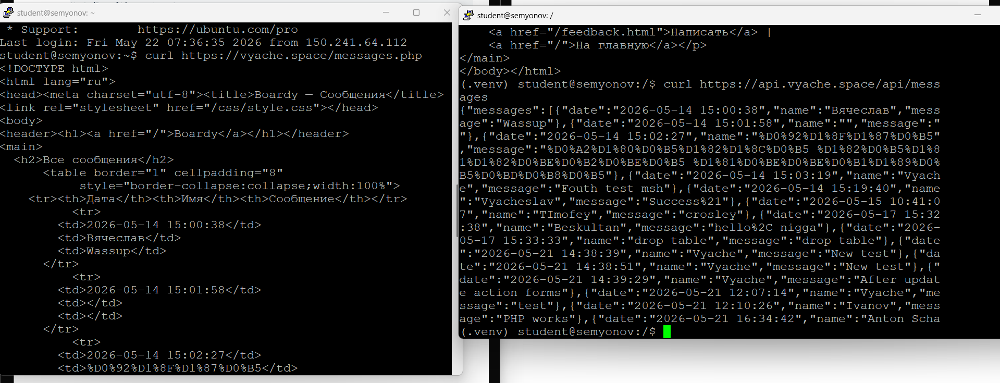
### 14. Процессы
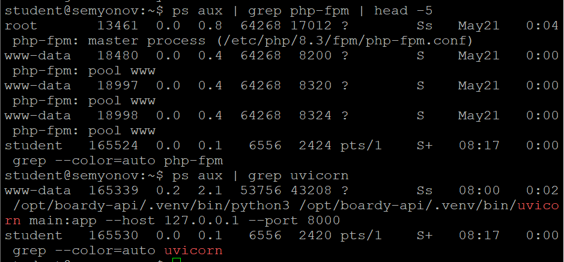
### Pull-request
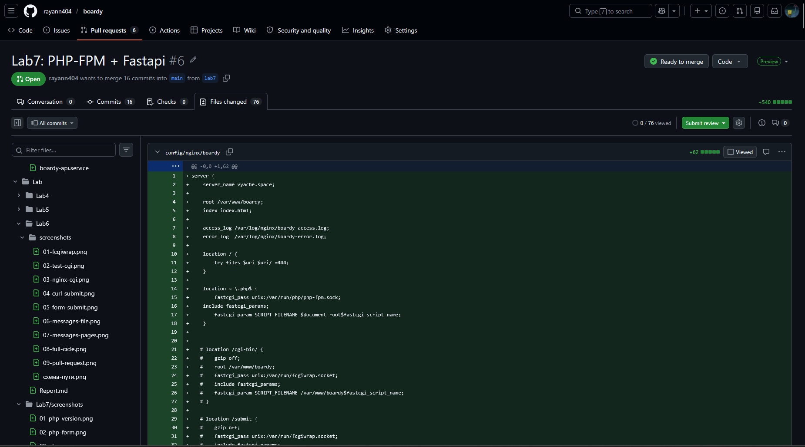
