# Отчёт к лабораторной работе №8 Семёнов В.А.
## MySQL
### 1. Установка MySQL

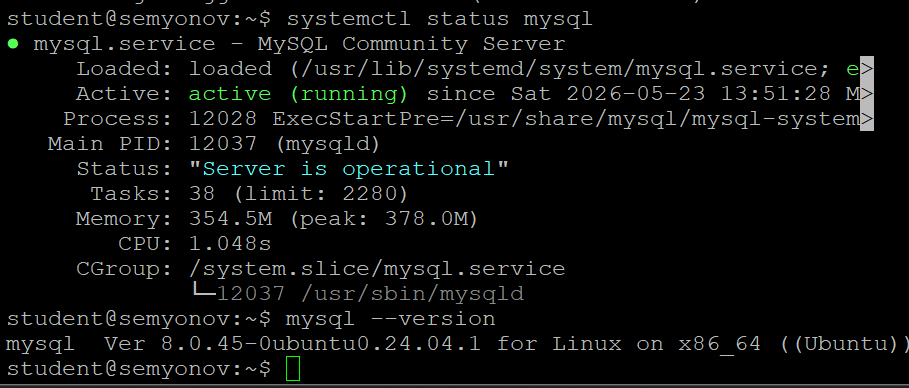
### 2. База данных и пользователь

Потому что utf8 - цитирую методичку: "исторический костыль". Т.е это старый вариант UTF-8 в MySQL, который не поддерживает абсолютно все языки и тем более эмодзи. А utf8mb4 же считается полноценным Unicode, потому что поддерживает все языки, эмодзи и современные unicode символы. 

Collation - параметр, который задает по какому принципу сравнивать символы, которые хранятся в БД. Unicode_ci подразумевает точное сравнение Unicode символов по правилам

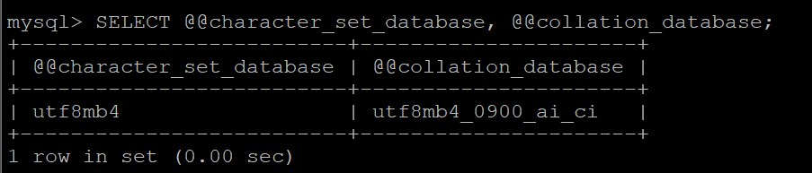
### 3. phpMyAdmin

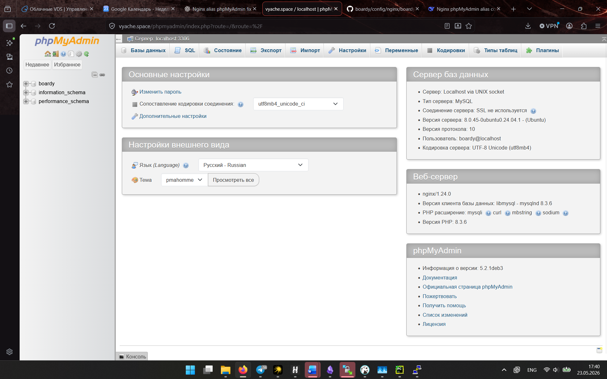
### 4. Три таблицы

FK - внешний ключ на атрибут другой таблицы. 
ON DELETE CASCADE означает, что при удалении юзера его посты также будут удалены
Движок используется InnoDB, потому что он обеспечивает ACID, что нужно нам, т.к никакой пост не должен теряться, а также нужны FK, чего нет в MyISAM

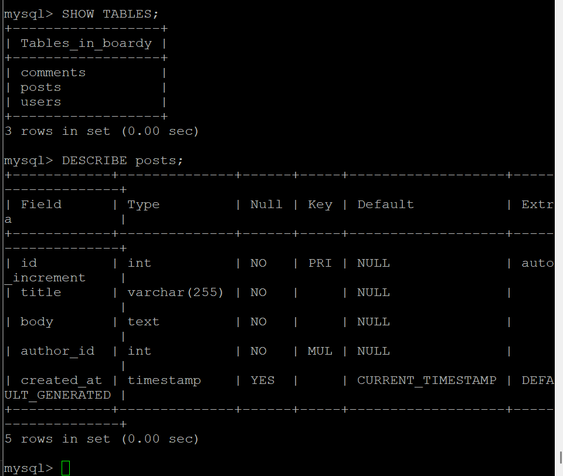
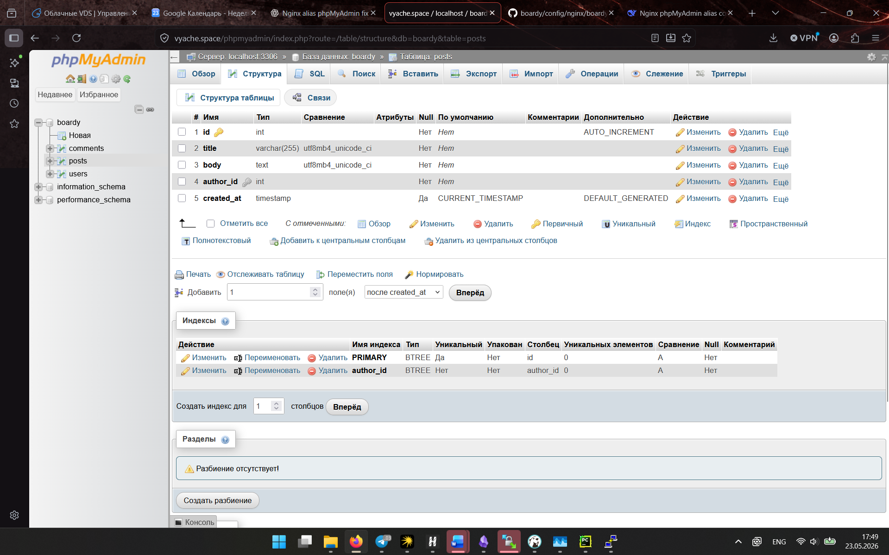
### 5. SQL-скрипт

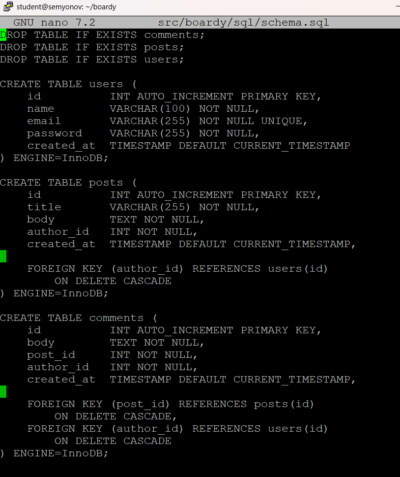
### 6. INSERT

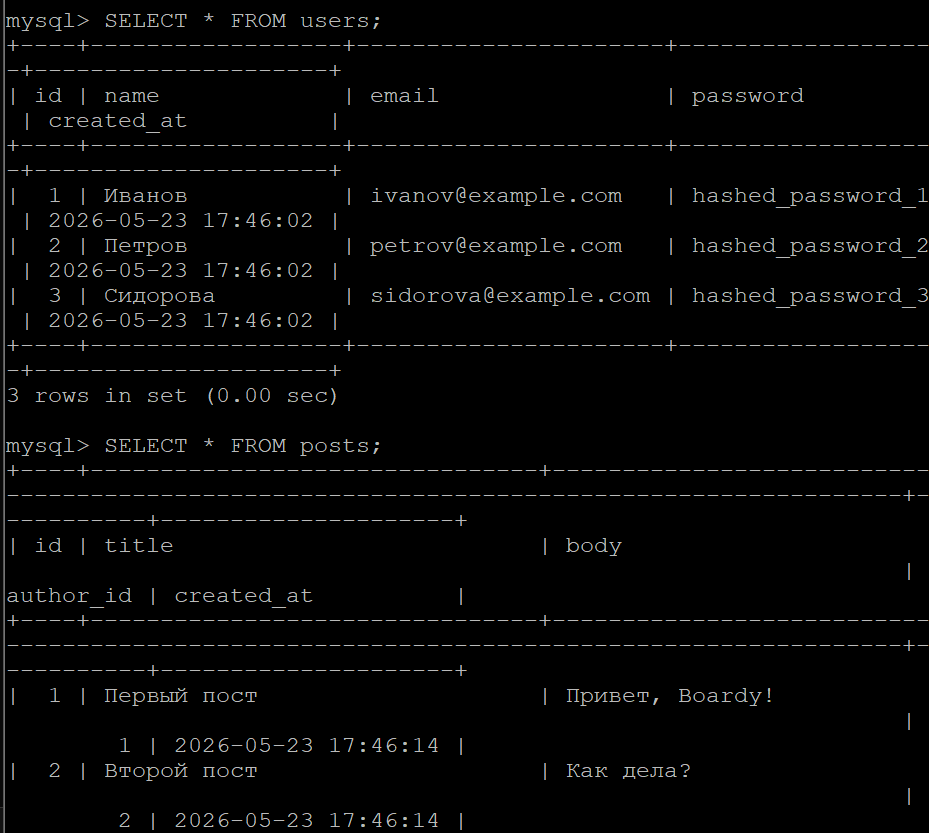
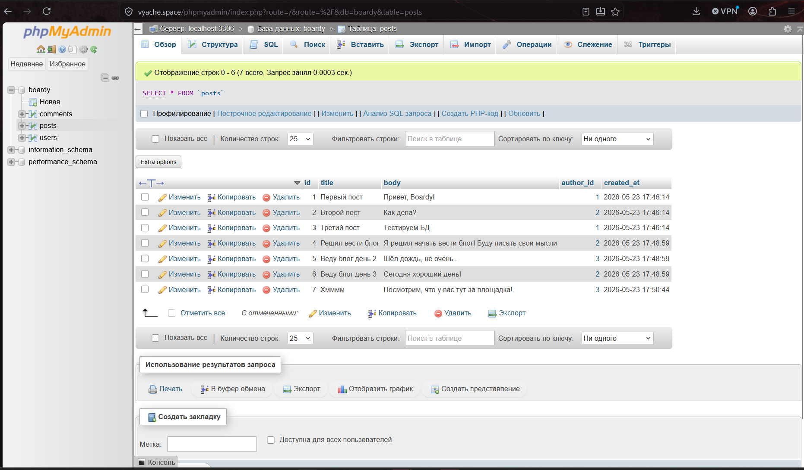
### 7. SELECT + JOIN

Join используется для того, чтобы можно было объединять несколько таблиц в 1 по связанным в них полям. Получить имя автора без него в 1 таблице можно через подзапрос, т.е:
```
SELECT
    title,
    body,
    (
        SELECT name
        FROM users
        WHERE users.id = posts.author_id
    ) AS author
FROM posts;
```

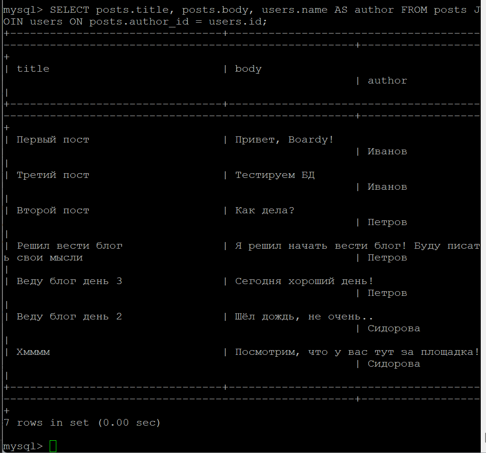
### 8. Foreign Key — защита целостности

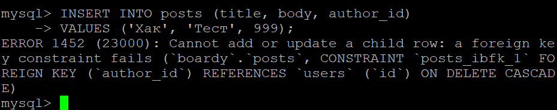
### 9. CASCADE

Потому что в slow-blocking используется time.sleep(), который полностью блокирует event loop и не дает обработать запросы параллельно, как asyncio.sleep

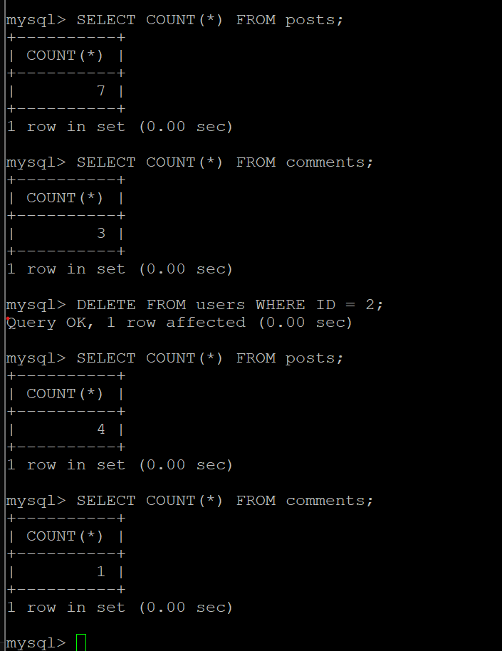
### 10. SQL-инъекция

SQL инъекция - это способ встроить в запрос, который формируется напрямую в БД, какой-либо вредоносный SQL код. 
Prepared statement защищает от подобного рода махинаций путем предварительной обработки SQL запроса без переменных. Т.е сначала БД получает SQL код, понимает что за запрос и только после этого получает переменные. 

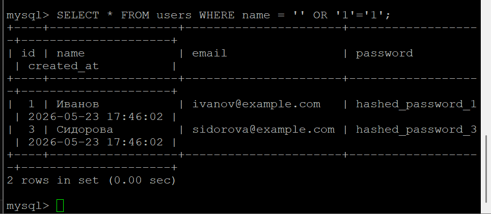
### 11. db.php

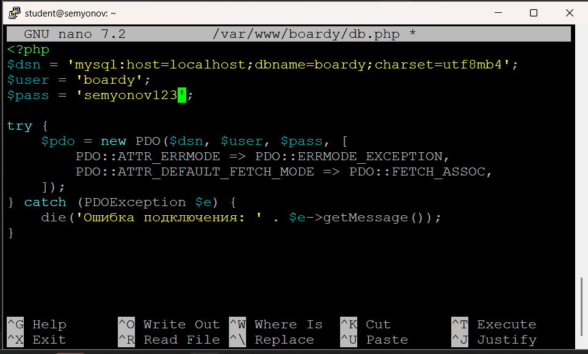
### 12. submit.php через MySQL


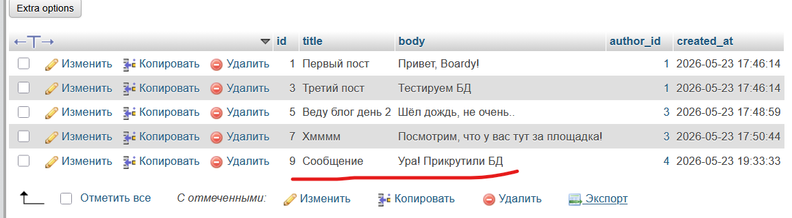
### 13. messages.php через MySQL

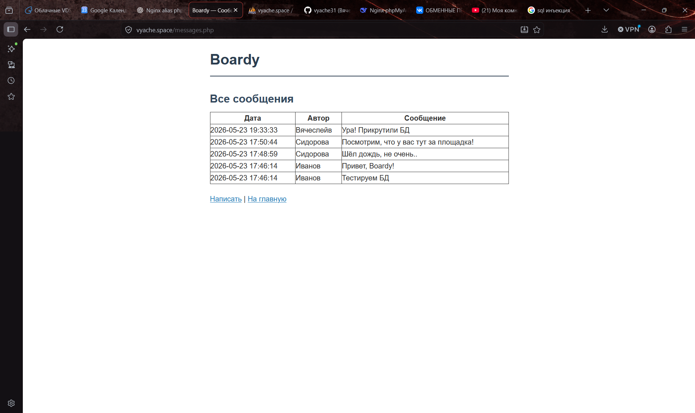
### 14. aiomysql

Потому что обычный mysql-connector бы блокировал event loop при запросах к БД, а await позволяет работать с ними параллельно 

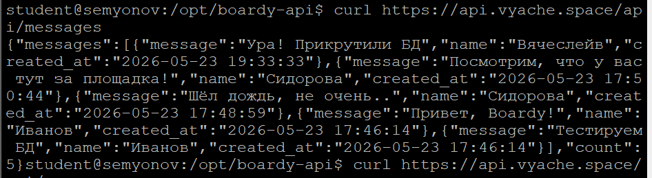
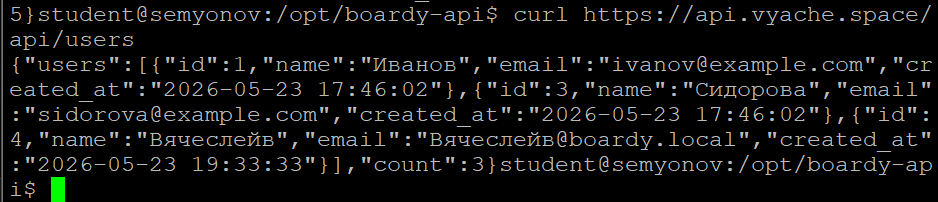
### Pull-request
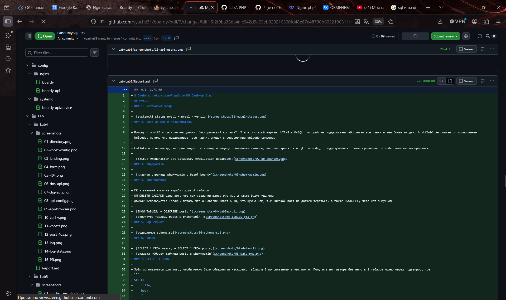
