# Отчёт к лабораторной работе №9 Семёнов В.А.
## REST API, SSR vs CSR, JS, REACT
### 1. Структура проекта

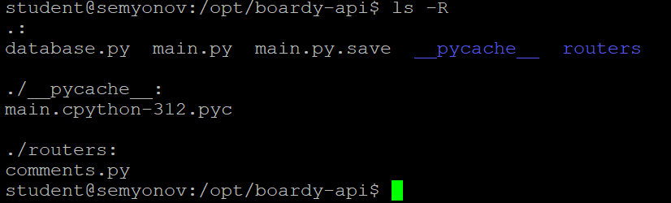
### 2. GET — список комментариев

Запрос, который выполняет данная ручка:
```
'SELECT c.id, c.body, c.created_at, '

            'u.name AS author_name '      # ← имя из связанной таблицы

            'FROM children c '

            'JOIN users u ON c.author_id = u.id '

            'WHERE c.parent_id = %s '     # ← фильтр по родителю

            'ORDER BY c.created_at',

            (parent_id,)
```

JOIN нужен для того, чтобы запрос вернул таблицу с информацией о комментарии, т.е его поля, а также добавил ещё одно поле author_name с помощью JOIN из users

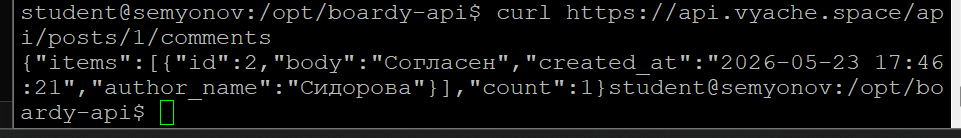
### 3. POST — создать комментарий

Потому что 200 - ОК, а 201 - создано. Content-Type означает, что сервер вернул данные в виде JSON файла

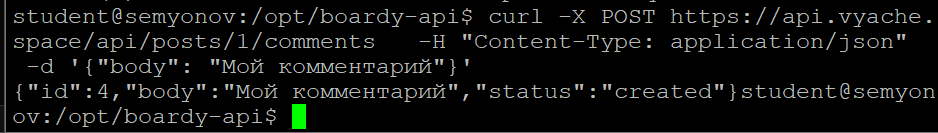
### 4. PUT — редактировать

POST добавляет новую запись в БД, PUT полностью изменяет уже созданную или добавляет новую, если таковой записи ещё не было
Разные URL, потому что по первому мы обращаемся к обособленному комменту, а на 2 адресе мы обращаемся к комментах какого-то конкретного поста

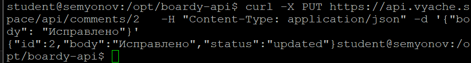
### 5. DELETE — удалить

POST - 201, потому что мы создаём ресурс
GET - 200, OK, потому что мы успешно нашли ресурс
PUT - 200, опять нашли ресурс и обновили, 204 если не нашли
DELETE - 204, потому что удаляем ресурс и вернуть нечего

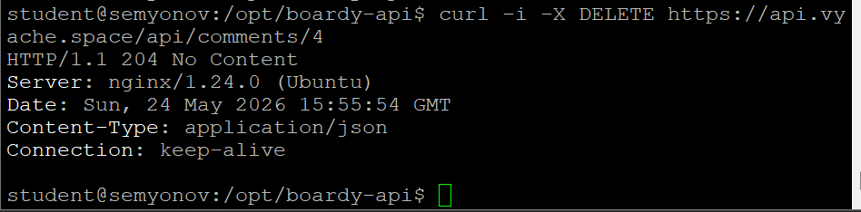
### 6. Ошибки

Ресурса нет в принципе - 404
Он есть, но данные неверные - 422

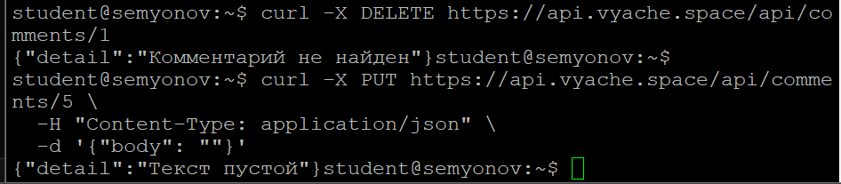
### 7. Swagger

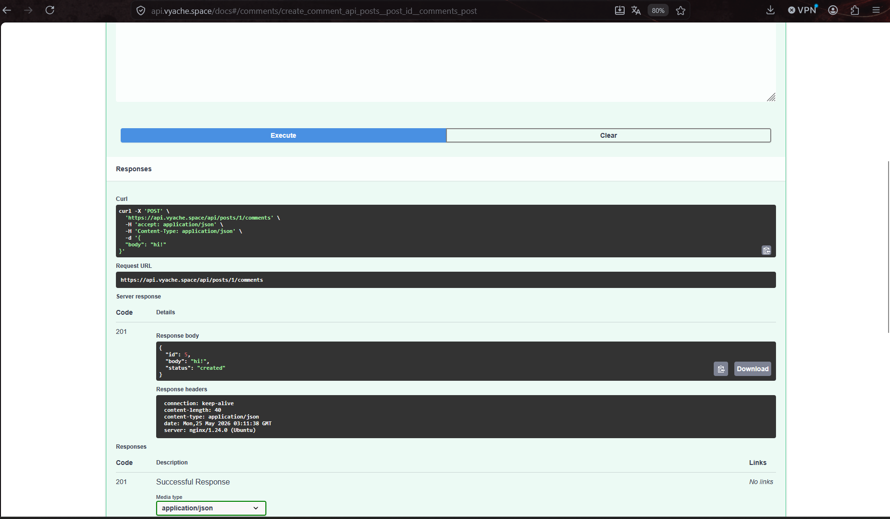
### 8. Vanilla JS — демо

функция esc() экранирует символы <>&"", преобразуя зловредный скрипт в обычный текст. Таким образом, если её не вызывать, то злодей сможет вставить какой-либо скрипт через нашу форму

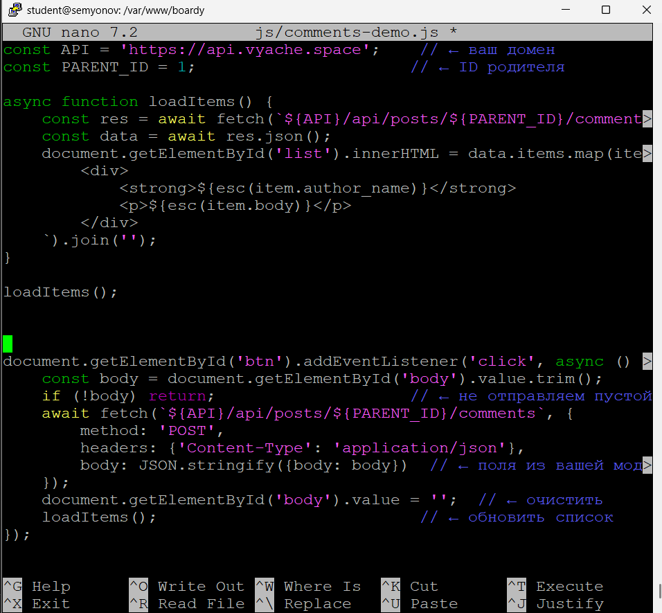
### 9. React — полный CRUD

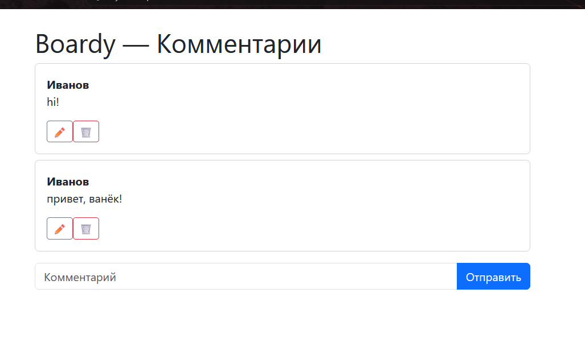
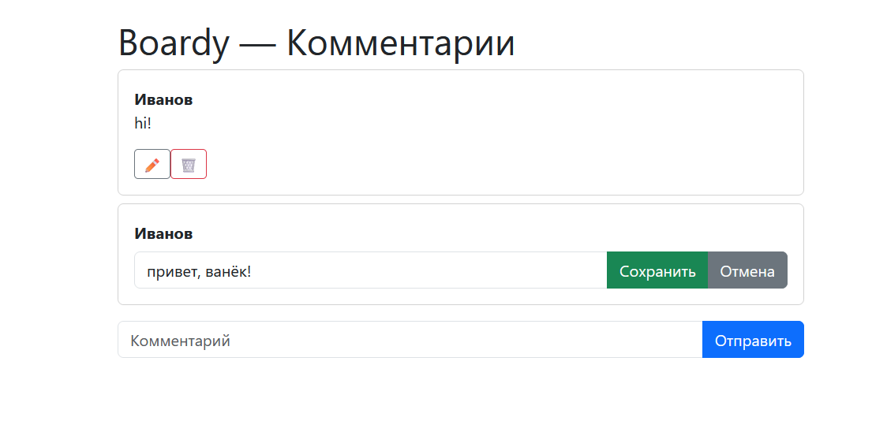
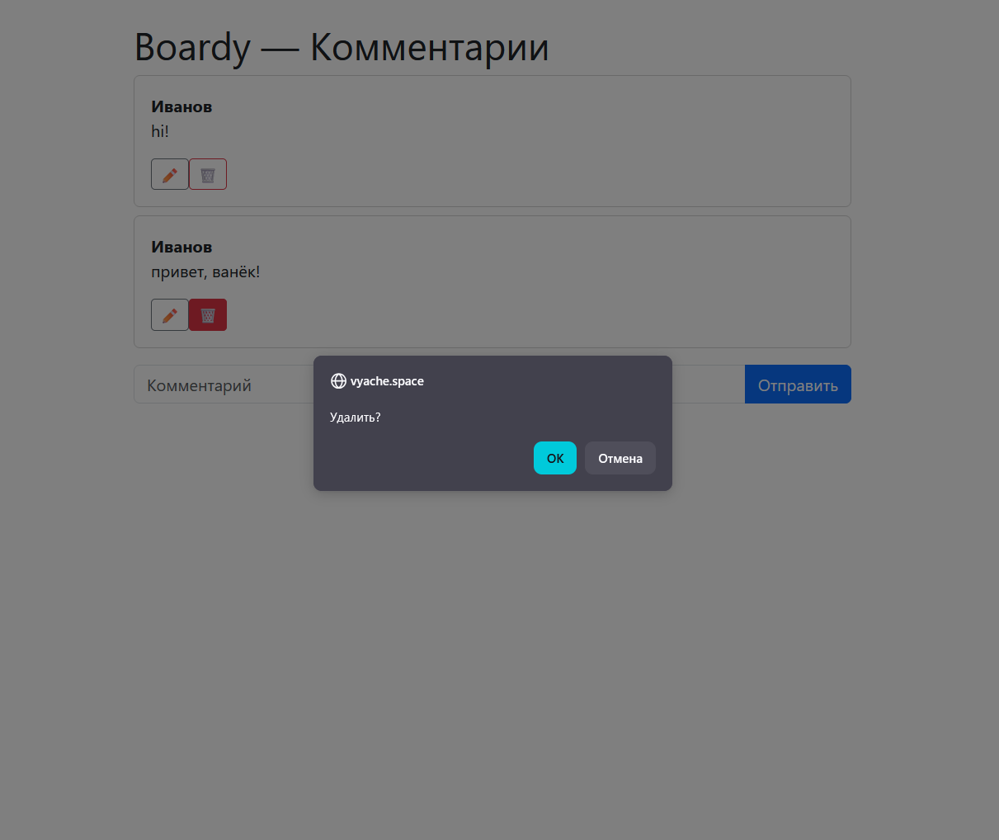
### 10. Сравнение кода

— Где хранится состояние (список комментариев, текст формы)?
	Состояние хранится в React c помощью UseState
	В ванилле состояние хранить негде, поэтому перезагружаем всё каждый раз

— Как обновляется список после добавления?
	В ванилле InnerHTML перестраивает весь DOM, а в реакте это происходит автоматически
	
— Как реализовано редактирование?
	В реакте используется условный рендер, а в ванилле нам бы самим пришлось создавать инпут, обновлять дом элементы и т.д

— Как защищаемся от XSS?
	В ванилле приходиться вручную экранировать HTML, забыли - плохо
	В реакте же он сам автоматом экранирует элементы

### 11. DevTools → Network

Всего 8 запросов, 1 из которых я вообще хз что такое, отправляется еще и на других сайтах постоянно.. Из них только 1 к API - последний

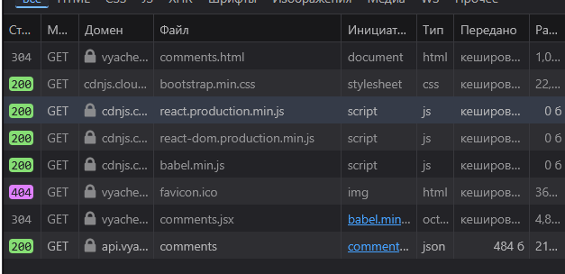

### 12. View Source

Потому что в CSR клиент получает чистую html страницу без данных, затем получает их с сервера с помощью API и реакт уже отрисовывает

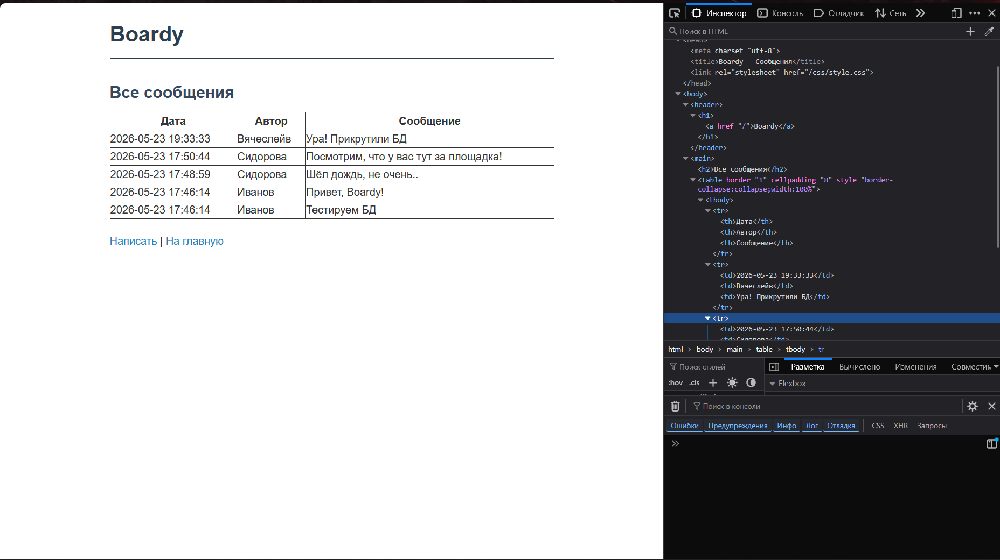
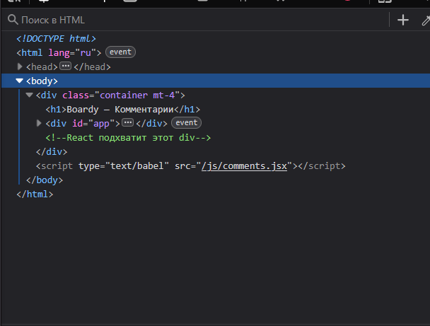
### 13. XSS

В ванилле приходиться вручную экранировать HTML, забыли - плохо
В реакте же он сам автоматом экранирует элементы. Поэтому в React надеждее, нет шанса забыть

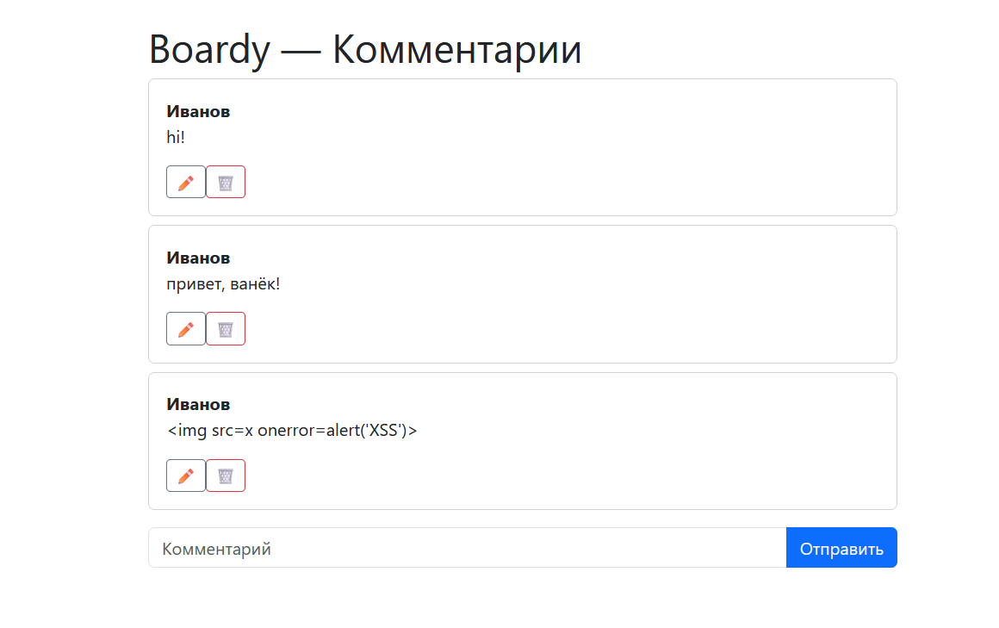
### 14. Итоговая таблица


|                           | SSR (PHP) | vanilla JS | React         |
| ------------------------- | --------- | ---------- | ------------- |
| Кто рендерит HTML         | Серер     | Клиент     | Клиент        |
| Формат ответа сервера     | HTML      | Json       | Json          |
| View Source: данные видны | Да        | Нет        | Нет           |
| Перезагрузка при отправке | Да        | Нет        | Нет           |
| Защита от XSS             | Вручную   | Вручную    | Авто          |
| Сложность кода            | маленькая | средняя    | выше среднего |


### Pull-request
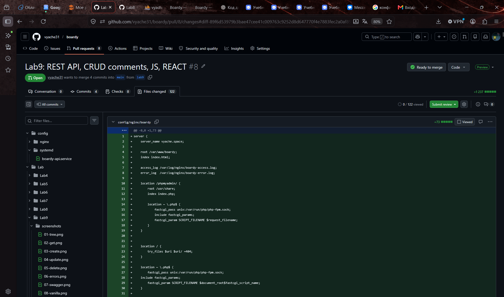
